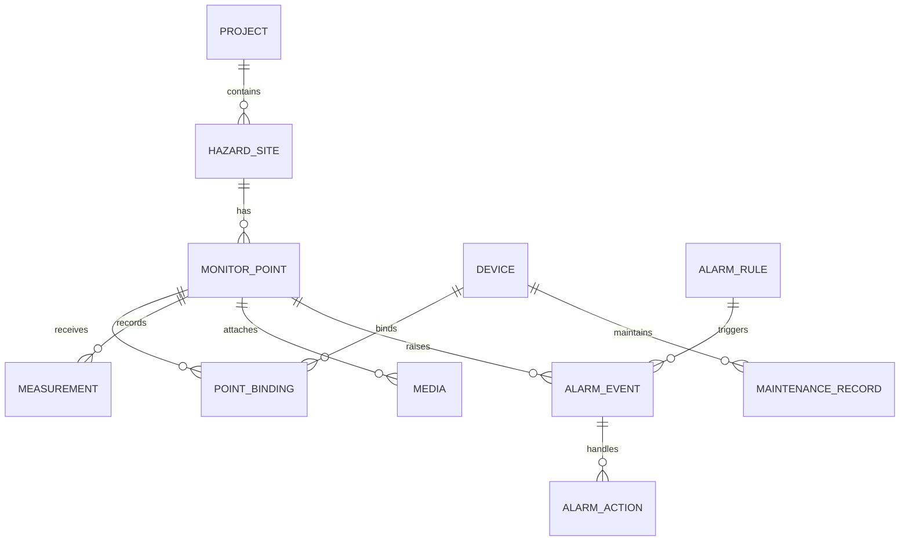
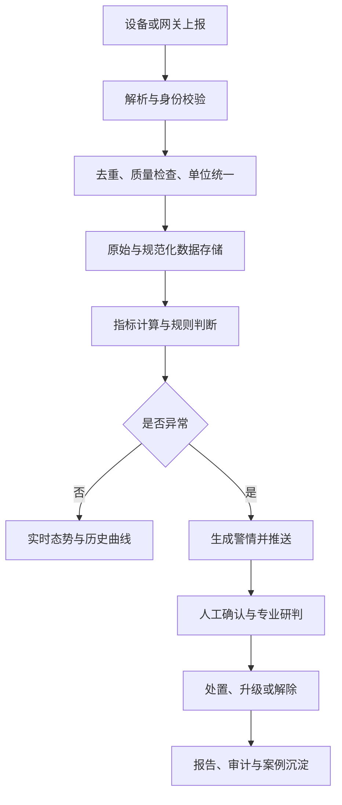
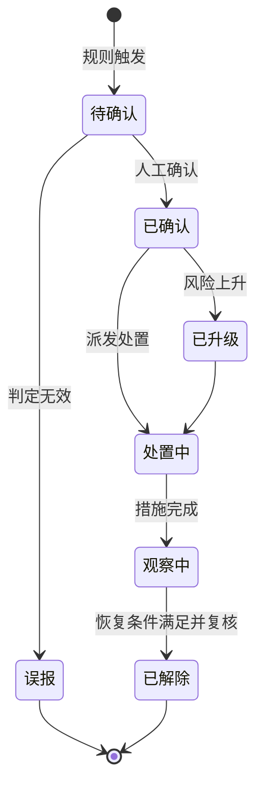
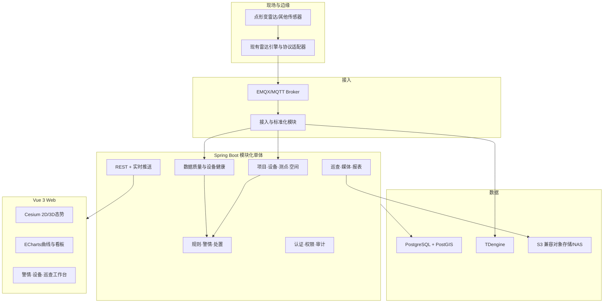

# 监测预警系统需求基线与总体技术方案（v0.1）

> 文档目的：在进入分工和编码前，先回答两个问题：**到底要做什么**，以及**用怎样的整体框架实现**。
>
> 当前状态：需求澄清稿，不是最终需求规格说明书。凡标记为“待确认”的内容，未经项目负责人或实际用户确认，不应直接进入开发。

## 1. 本次审阅范围

已完整审阅以下三份材料：

1. 《调研文档_通用监测管理系统.md》
2. 《技术文档_华测对标监测系统_20260907.md》
3. 《新对话提示词_学习SpringBoot_20260908.md》

同时参考了华测边坡/地灾监测公开方案、广东省现行《DB44/T 2457—2024 地质灾害自动化监测规范》、自然资源行业相关标准目录，以及 Spring Boot、TDengine、PostGIS、EMQX、CesiumJS 的官方资料。

## 2. 先给结论

### 2.1 项目应如何重新定位

当前最合理的定位不是“一开始做覆盖铁路、边坡、矿山和多种传感器的通用工业平台”，而是：

> **先建设一套面向清远电厂地质灾害场景的监测预警系统 V1，以公司点形变雷达为首个真实数据源，打通监测数据接入、质量检查、空间挂接、实时展示、预警处置和运维留痕闭环；在数据模型和模块边界上预留新增传感器及其他场景的扩展能力。**

这句话包含三个层次：

| 层次 | 本阶段含义 |
|---|---|
| 当前项目 | 清远电厂地质灾害监测预警系统 V1 |
| 首个真实能力 | 点形变雷达的接入、展示、预警、处置、运维 |
| 长期产品方向 | 可扩展到水位、雨量、GNSS、测斜、视频/无人机及其他场景 |

“通用”应表现为领域模型、数据接口和模块边界可扩展，而不是首版同时实现所有场景与设备。

### 2.2 首版不是单纯的大屏，也不是完整数字孪生

首版核心价值是形成两条业务闭环：

1. **监测预警闭环**：设备上报 → 数据校验 → 时序存储 → 指标计算 → 规则触发 → 人工确认 → 处置/解除 → 全程留痕。
2. **设备运维闭环**：设备状态/数据质量异常 → 故障告警 → 运维处理 → 恢复确认 → 维护记录。

Cesium 三维场景只是空间化交互入口。若当前没有高精度地形、BIM、点云、动态仿真模型和模型状态同步，就不宜把首版宣传为完整“数字孪生”；更准确的名称是“**三维地理监测态势图**”。CesiumJS 本身支持 3D、2D、地形、影像、3D Tiles、动态数据与交互，因此首版无须再并行维护一套 Leaflet 地图。[CesiumJS 官方说明](https://cesium.com/platform/cesiumjs/)

### 2.3 技术路线的核心结论

两人开发的首版应采用：

> **Vue 3 前端 + Spring Boot 3 模块化单体后端 + 独立雷达算法/协议适配进程 + MQTT + PostgreSQL/PostGIS + TDengine + 对象存储 + Docker Compose。**

暂不默认采用 Spring Cloud 微服务、Kafka、Redis 集群和 Kubernetes。它们不是不能用，而是只有达到明确的规模或可靠性条件后才值得引入。

## 3. 现有文档的主要问题

### 3.1 四种不同层级被混写

现有材料同时描述了：

- 公司长期产品愿景：通用、多场景、多传感；
- 清远电厂具体交付项目；
- 华测竞品功能对标；
- 个人 Spring Boot 学习原型。

这四者的目标、交付标准和工作量完全不同。若不拆开，容易把“未来愿景”误当作“首版必须完成”，也容易把“学习 Demo”误当成项目架构。

### 3.2 功能清单不等于需求

“项目管理、设备管理、实时监测、3D、告警、报表”只是模块名称，尚未回答：

- 谁使用？
- 在什么场景下操作？
- 输入数据来自哪里？
- 操作完成后状态如何变化？
- 异常、重复、延迟和断网如何处理？
- 怎样算验收通过？

### 3.3 传感器范围互相矛盾

一份文档面向雷达、位移、水位、测斜、GNSS、相机等多传感器；另一份把首版缩为点形变雷达和无人机照片。这里必须拆成：

- 首版真实接入的设备；
- 首版只做模拟验证的设备；
- 仅预留扩展接口的设备。

### 3.4 “无人机接入”至少有四种完全不同的需求

| 需求层次 | 工作内容 | 难度 |
|---|---|---|
| 照片人工上传 | 上传照片并手工关联项目/监测点 | 低 |
| 批量导入 | 读取 EXIF、拍摄时间、经纬度并自动推荐关联点 | 中 |
| 第三方平台对接 | 从无人机平台 API 获取任务、照片、航迹 | 中高 |
| 自动调度与建模 | 控制机库/航线，生成正射影像、点云或三维模型 | 高 |

建议 V1 只做前两层。没有明确设备型号、平台 API、RTK/EXIF 样例和航线流程前，不应承诺后两层。

### 3.5 现有“告警”描述过于简单

阈值触发只是告警生成条件，不是完整预警业务。至少需要区分：

- 监测预警：形变等指标反映地质风险；
- 数据质量告警：迟到、缺失、重复、越界、粗差；
- 设备故障告警：离线、低电量、通信异常、传感器故障；
- 系统运行告警：存储、服务、消息积压等平台异常。

广东地方规范要求平台动态展示设备在线状态/在线率，以及数据完整性、粗差比、采样间隔和时效性；也要求支持项目、点位、采样频率和预警阈值调整，并监控设备、供电、通信、存储状态。[DB44/T 2457—2024](https://qxb-img-osscache.qixin.com/standards/baa686084442d07ae4895ca8d10baed9.pdf)

### 3.6 技术栈在不同文档中冲突

- Java / Spring Boot 与 Python / FastAPI 冲突；
- TDengine 与 TimescaleDB 冲突；
- Vue 3 与 React 冲突；
- EMQX 与 Mosquitto 冲突；
- 单体、Spring Cloud 微服务均有暗示。

这不是简单选“更先进”的问题，而是要根据既有资产、团队人数、交付规模和运维条件作取舍。

### 3.7 被遗漏但可能属于硬要求的内容

现有文档弱化了以下工业监测系统常见要求：

- 数据原始报文与处理结果的可追溯；
- 数据质量标记及异常数据人工复核；
- 设备安装、标定、维护、替换和运行记录；
- 预警确认、误报标记、升级、降级、解除和处置记录；
- 人工巡查、照片和宏观现象上报；
- 备份恢复、审计日志、数据权限；
- 与上级平台或其他系统的数据接口；
- 验收指标及压力规模。

自然资源行业已经有《DZ/T 0442—2023 地质灾害监测预警数据库建设规范》和《DZ/T 0450—2023 地质灾害监测数据通信技术要求》，说明数据库结构与通信接口不能完全自行随意定义。[标准目录](https://std.cgs.gov.cn/category/3?cat=&relation=&s=&subject=7)

## 4. 需求边界

### 4.1 系统边界内

- 管理项目、隐患区域、设备、监测点、空间位置与标定配置；
- 接收或导入监测数据，并保留原始数据追溯信息；
- 对数据进行格式校验、去重、质量标记、单位统一和必要的派生计算；
- 存储和查询时序数据、空间数据、图片附件与业务档案；
- 实时展示监测点状态、数据曲线和空间位置；
- 按已批准的规则生成预警，并支持人工确认和处置闭环；
- 识别设备离线、低电量、数据中断等运行异常；
- 记录巡查、复核、运维和审计信息；
- 提供基础报表、导出和对外接口。

### 4.2 首版边界外

- 自研雷达信号处理算法本身；
- 自研无人机飞控、机库控制和自动航线系统；
- 自动生成高精度倾斜摄影模型、点云配准及多期三维变化检测；
- 未经专业人员确认的自动灾害结论或全自动应急决策；
- 一开始覆盖铁路、矿山等所有场景；
- 大规模多租户 SaaS、跨地域容灾、复杂微服务治理；
- 以机器学习替代首版的可解释阈值/组合规则。

## 5. 使用者和权限角色

| 角色 | 核心诉求 | 典型权限 |
|---|---|---|
| 系统管理员 | 维护账号、角色、字典、系统参数 | 系统配置与全局审计 |
| 项目管理员 | 建项目、区域、设备、点位和规则 | 项目内配置与授权 |
| 值班监测人员 | 看实时数据、接收并确认警情 | 查看、确认、填写处置过程 |
| 专业研判人员 | 复核曲线、照片和现场现象 | 调整研判结论、建议升级/解除 |
| 运维人员 | 处理设备离线、低电量和数据异常 | 设备状态、工单、维护记录 |
| 领导/访客 | 查看态势与统计，不修改数据 | 项目只读 |
| 设备/边缘网关 | 上报数据、状态，接收受控命令 | 仅设备接口，独立认证 |
| 外部系统 | 查询或接收授权数据与警情 | API 级授权 |

RBAC 还不够，还需要“数据范围权限”：用户只能访问被授权的项目或区域。

## 6. 核心业务对象

建议以以下对象作为系统的稳定骨架：



关键对象解释：

| 对象 | 说明 |
|---|---|
| Project | 交付或运营项目，如清远电厂项目 |
| HazardSite/Area | 隐患点、边坡区域或监测分区，不等同于传感器测点 |
| Device | 物理设备档案、协议、序列号、在线/电量/故障状态 |
| MonitorPoint | 业务上的监测位置，可绑定一个或多个设备/测项 |
| MetricDefinition | 测项定义，如累计形变、速率、水位、雨量及其单位 |
| Measurement | 某测点某测项在某时刻的值和质量标记 |
| CalibrationProfile | 标定参数、坐标系、版本、有效期和误差说明 |
| AlarmRule | 指标、时间窗口、阈值、等级、恢复条件、抑制策略 |
| AlarmEvent | 一次实际警情，具有等级和生命周期 |
| AlarmAction | 确认、研判、升级、降级、派发、处置、解除等动作 |
| Inspection | 人工巡查、人工比测和宏观现象记录 |
| Media | 无人机/现场照片、视频、报告等附件 |
| MaintenanceRecord | 安装、调试、标定、维修、更换、恢复记录 |

## 7. 完整业务闭环



系统不能在 H 处结束。没有 I～K，就只有“报警提示”，没有“预警管理”。

## 8. 分阶段功能需求

### 8.1 P0：最小可交付闭环（首版必须）

#### A. 登录、权限与审计

- 用户登录、退出、密码修改；
- 用户、角色、菜单/操作权限；
- 按项目的数据范围权限；
- 关键配置和警情操作审计日志。

#### B. 项目与空间档案

- 项目、隐患区域/分区、监测点增删改查；
- 监测点坐标、海拔、照片、状态和基础说明；
- 地图/三维态势图展示区域、设备和测点；
- 点击测点查看最新值、历史曲线、警情和照片。

#### C. 设备与绑定

- 设备类型、型号、编号、协议、安装位置和运行状态；
- 设备与监测点/测项绑定；
- 设备上线、离线、最近通信时间、低电量等状态；
- 安装、标定和维护记录。

#### D. 点形变雷达数据接入

- 复用现有雷达后端的解析/算法结果，不在平台内重写算法；
- 通过标准消息封装接收 `seq/angle/distance/signal/state/cumulative_defo_mm` 等数据；
- 记录设备时间、平台接收时间、消息序号和原始报文引用；
- 支持模拟器和真实设备两种输入，便于独立开发与验收。

#### E. 数据处理与质量

- 设备、消息和字段合法性校验；
- 依据设备 ID + 消息 ID/序号 + 采集时间实现幂等去重；
- 单位统一和数据质量标记；
- 标记迟到、缺失、重复、越界、粗差、设备异常数据；
- 原始值与修正/派生值分开保留，不覆盖原始记录；
- 展示在线率、完整率、延迟和异常数据数量。

#### F. 时序查询和实时展示

- 最新数据列表；
- 按项目、区域、测点、指标和时间范围查询；
- 累计形变曲线和形变速率曲线；
- 实时数据与警情推送；
- CSV 导出。

规范要求变形类成果至少包含累计变形时程曲线和变形速率曲线，不能只显示累计值。[DB44/T 2457—2024](https://qxb-img-osscache.qixin.com/standards/baa686084442d07ae4895ca8d10baed9.pdf)

#### G. 预警规则和警情闭环

- 首版支持累计值、变化量、速率和持续时间等可解释规则；
- 规则包含适用对象、级别、时间窗口、触发阈值、恢复阈值、重复抑制和启停状态；
- 达到阈值生成警情，同一规则同一对象避免重复刷屏；
- 支持升级、确认、误报标记、派发、处置、降级和解除；
- 每次动作记录操作人、时间、意见和附件；
- 监测预警与设备/数据质量告警分开管理。

预警阈值应由地质/监测专业人员提出和确认，开发人员负责把已确认规则可靠实现，不负责自行确定灾害阈值。广东规范也要求预设阈值经过责任单位或专家论证。[DB44/T 2457—2024](https://qxb-img-osscache.qixin.com/standards/baa686084442d07ae4895ca8d10baed9.pdf)

#### H. 人工巡查与照片

- 手工新增巡查/复核记录；
- 上传现场或无人机照片；
- 按项目、区域、监测点、拍摄时间关联；
- 记录观察到的裂缝、掉块、积水等宏观现象；
- 从警情页面直接查看相关照片与巡查记录。

#### I. 部署与恢复

- Docker Compose 一键启动开发/试点环境；
- 配置、日志、数据库和文件分卷持久化；
- 数据备份与一次可验证的恢复演练；
- 健康检查和基础运行日志。

### 8.2 P1：首版稳定后增加

- 水位、雨量、GNSS、测斜等第二批传感器适配；
- 无人机照片 EXIF/RTK 自动解析和邻近测点推荐；
- 日报、周报、月报及模板化报告；
- 设备远程调频、止采、唤采及参数下发；
- 邮件、短信、企业微信等外部通知；
- 完整运维工单；
- 上级平台或第三方系统接口；
- 规则组合、多指标联动与更细的数据质量策略。

### 8.3 P2：明确有业务价值后再做

- 铁路里程/桩号等新场景坐标适配；
- 多传感融合风险模型；
- 机器学习趋势预测；
- 无人机自动任务调度、正射影像、点云及多期变化检测；
- 高精度三维模型/BIM/点云数字孪生；
- 多租户 SaaS；
- 微服务、Kafka、大规模集群和 Kubernetes；
- 移动端深度定制。

## 9. 关键状态模型

### 9.1 警情生命周期



告警级别与处理状态必须分开。例如“红色、处置中”是合法组合，不能用一个字段同时表达两者。

### 9.2 设备状态

- 启用状态：草稿、已安装、运行中、停用、报废；
- 通信状态：在线、迟到、离线、未知；
- 健康状态：正常、低电量、传感器异常、通信异常、维护中；
- 绑定状态：未绑定、已绑定、历史解绑。

## 10. 坐标与标定需求

“坐标可切换”不应只是前端地图按钮，而应有可追溯的数据模型。

每个位置至少保存：

- 原始坐标值；
- 原始坐标系/参考系；
- 转换后的平台标准坐标；
- 高程及高程基准；
- 转换/标定方法；
- 标定参数版本、有效时间、操作人和精度说明。

点形变雷达首版流程建议为：

> 雷达站点坐标 + 站点方位角 + 目标极坐标（角度、距离） → 局部 ENU 坐标 → 地理坐标 → PostGIS 空间点 → Cesium 展示。

铁路场景以后增加 `RailwayChainageAdapter`，将线路 ID、里程/桩号、横向偏移和高程映射到标准空间位置；不应让铁路字段侵入边坡首版的核心表。

## 11. 非功能需求：目前必须补齐的数字

以下项目不能用“高并发、实时、海量、工业级”代替，必须由负责人填写明确数字：

| 编号 | 待确认指标 | 示例口径 |
|---|---|---|
| NFR-01 | 首版设备数、点位数 | 设备 ___ 台，测点 ___ 个 |
| NFR-02 | 各设备上报频率 | 常态 ___，警情态 ___ |
| NFR-03 | 峰值消息量 | ___ 条/秒，单条 ___ KB |
| NFR-04 | 数据保存年限 | 原始 ___ 年，聚合 ___ 年 |
| NFR-05 | 实时延迟 | 采集到页面 P95 小于 ___ 秒 |
| NFR-06 | 并发用户 | 在线 ___ 人，查询 ___ QPS |
| NFR-07 | 可用性 | 试点 ___%，正式运行 ___% |
| NFR-08 | 断网补传 | 边缘缓存至少 ___ 小时/天 |
| NFR-09 | 部署位置 | 厂内网/政务云/公有云/混合 |
| NFR-10 | 安全要求 | 等保级别、TLS、密码与审计周期 |
| NFR-11 | 地图与三维数据 | 数据来源、坐标系、离线要求、授权 |
| NFR-12 | 备份恢复 | RPO ___，RTO ___ |

在这些数字确认前，无法严肃判断 Kafka、集群、分库分表或 Kubernetes 是否必要。

## 12. 建议总体架构



## 13. 后端架构：模块化单体优先

### 13.1 为什么不直接使用微服务

两人团队在首版直接采用 Spring Cloud Alibaba，通常会额外承担注册发现、网关、配置中心、服务间鉴权、链路追踪、分布式事务、容器编排和多服务部署，而这些并不会直接提升首版业务闭环。

建议单个 Spring Boot 应用按业务能力拆包，并保持模块只通过公开接口或领域事件交互。Spring Modulith 的官方定位正是帮助 Spring Boot 构建可验证的模块化应用，并可检查模块循环依赖、限制对内部包的访问。[Spring Modulith](https://docs.spring.io/spring-modulith/reference/index.html) [模块校验](https://docs.spring.io/spring-modulith/reference/verification.html)

建议模块：

```text
com.company.monitoring
├── auth             认证、用户、角色、数据权限
├── project          项目、隐患区域、组织关系
├── asset            设备、类型、绑定、维护记录
├── spatial          测点、坐标、标定、空间查询
├── telemetry        接入、指标定义、时序查询
├── quality          数据质量、设备在线与健康
├── alarm            规则、警情状态机、处置记录
├── inspection       巡查、人工比测、宏观现象
├── media            图片和附件元数据
├── report           统计、导出、报表
├── integration      MQTT、外部 API、对象存储适配
├── realtime         WebSocket/SSE 推送
└── audit            操作与配置审计
```

### 13.2 Python 的合理位置

Python/FastAPI 不作为第二套业务后端。仅在下列情况下保留独立 Python 进程：

- 复用现有雷达解析和信号处理引擎；
- 未来运行图像、点云或机器学习算法；
- 对外提供算法调用接口。

Java 后端负责业务事实和状态，Python 服务负责算法结果。二者通过版本化消息/API 契约连接，避免双方直接共享数据库表。

## 14. 技术栈建议与取舍

| 层 | V1 建议 | 说明 |
|---|---|---|
| 前端 | Vue 3 + TypeScript + Vite | 与既定方向一致，类型约束有利于两人协作 |
| UI | Element Plus | 管理后台成熟 |
| 图表 | ECharts | 时序曲线、状态和统计 |
| 空间 | CesiumJS | 同一引擎支持 3D/2D/2.5D，减少双地图维护 |
| 后端 | Java 17 + Spring Boot 3 | 业务主后端 |
| 模块治理 | 包级边界；可选 Spring Modulith | 保持单体部署、模块化设计 |
| 数据访问 | MyBatis-Plus + 必要的手写 SQL | CRUD 提效，复杂查询不强行套生成器 |
| 安全 | Spring Security + JWT + RBAC + 项目数据权限 | 管理端和 API 统一鉴权 |
| 关系/空间 | PostgreSQL + PostGIS | 项目、设备、点位、警情和空间查询；PostGIS 提供空间类型、函数和空间索引。[官方文档](https://postgis.net/docs/manual-3.5/) |
| 时序 | TDengine | 监测数据与聚合数据；官方提供 Java 连接器和无模式写入，但生产模型仍应受版本化契约约束。[TDengine](https://docs.tdengine.com/product-intro/) |
| 消息接入 | MQTT + EMQX | 若公司说明书和现有环境已确定 EMQX，则保持一致 |
| 大文件 | 抽象为 S3 兼容接口；开发可用 MinIO，生产按授权和部署条件确定 | 业务代码不绑定具体供应商 |
| 实时推送 | WebSocket；若仅单向推送可改 SSE | 浏览器不直接连接设备 MQTT |
| API 文档 | OpenAPI/Swagger | 前后端并行契约 |
| 数据迁移 | Flyway | 数据库结构版本化 |
| 测试 | JUnit 5、Testcontainers、前端单元/E2E | 覆盖告警、权限、幂等和状态机 |
| 部署 | Docker Compose + Nginx | 适合开发、演示和单机试点 |
| 监控 | Actuator + Prometheus/Grafana（按部署需要） | 服务健康、吞吐、错误和积压 |

### 14.1 Kafka 何时才需要

EMQX 可以将 MQTT 数据通过规则和数据桥接入 Kafka，但这是为下游多消费者、流式处理和更大规模解耦准备的能力，并不意味着所有 MQTT 项目都必须同时使用 Kafka。[EMQX 官方说明](https://docs.emqx.com/en/emqx/latest/data-integration/data-bridge-kafka.html)

出现以下任一情况再引入 Kafka：

- 单一消息需要被存储、告警、实时计算、AI、外部推送等多个独立系统消费；
- 需要长期可重放的事件流；
- 峰值吞吐超过单体接入模块可稳定承担的范围；
- 接入与业务必须独立扩缩容；
- 已有公司级 Kafka 平台和成熟运维能力。

### 14.2 Redis 何时才需要

首版可不用 Redis。出现热点最新值缓存、分布式限流、短期状态共享或多实例部署后再增加。JWT 不天然要求 Redis；只有需要即时撤销、黑名单或集中会话时才需要。

### 14.3 Kubernetes 何时才需要

只有进入多节点、高可用、弹性伸缩、统一集群运维阶段再采用 K8s。首版 Docker Compose 更容易部署和排障。

## 15. 数据存储划分

### PostgreSQL/PostGIS 保存

- 用户、角色、权限、项目与组织；
- 隐患区域、设备、监测点、坐标与标定版本；
- 指标定义、设备绑定；
- 告警规则、警情、处置动作；
- 巡查、运维、媒体元数据；
- 配置版本、审计日志、外部接口配置。

### TDengine 保存

- 高频/连续监测数据；
- 设备状态时序；
- 累计值、速率、加速度等派生指标；
- 数据质量标记；
- 分钟/小时/日聚合。

不建议把所有数据塞入一个任意 JSON 表。可采用“按测项族划分超级表”的方式，例如形变、环境量、设备状态分别建模；公共标签包含项目、设备、测点、指标编码和数据版本。TDengine 支持 Java 连接器和无模式写入，但“无模式”适合接入便利，不等于业务模型不需要治理。[TDengine Java 连接器](https://docs.tdengine.com/developer-guide/connectors-reference/java/) [无模式写入](https://docs.tdengine.com/developer-guide/schemaless/)

### 对象存储保存

- 原始照片、缩略图、视频片段；
- 原始大报文或批量导入文件；
- 导出报告；
- 三维模型、地形切片等大文件。

关系库只保存对象键、哈希、大小、类型、拍摄信息、关联对象和权限元数据。

## 16. 数据接入契约建议

平台接收的标准消息至少包括：

```json
{
  "schemaVersion": "1.0",
  "messageId": "unique-id",
  "deviceId": "radar-001",
  "metricCode": "cumulative_deformation",
  "collectTime": "2026-09-09T10:00:00.000+08:00",
  "sequence": 12345,
  "value": 2.36,
  "unit": "mm",
  "quality": "RAW",
  "position": {
    "angleDeg": 15.2,
    "distanceM": 87.4
  },
  "attributes": {
    "signal": 0.91,
    "state": "normal"
  }
}
```

需遵守：

- 采集时间与接收时间分开；
- `schemaVersion` 明确消息结构版本；
- 数值和单位分开；
- 设备唯一标识不可依赖展示名称；
- 原始消息可追溯；
- 重复消息不重复生成数据和警情；
- 不同协议适配器只负责转换为标准消息，不直接写业务表。

## 17. 首版验收场景

以下场景比“页面做完”更适合作为验收依据：

1. 模拟器或真实雷达连续上报，平台能识别设备、落库并在测点页面实时刷新。
2. 相同消息重复发送，不产生重复测量值和重复警情。
3. 数据延迟、缺失或设备断联时，平台能标记质量问题并生成对应设备/数据告警。
4. 累计形变或速率达到已配置阈值时生成警情；持续超限不刷屏，等级升高时能升级。
5. 值班人员能确认警情，专业人员能填写研判，运维/处置人员能上传记录，最终可解除并完整追溯。
6. 在 Cesium 中点击测点能看到最新值、历史曲线、告警和照片。
7. 普通用户无法访问未授权项目，关键配置修改有审计记录。
8. 服务重启后业务数据不丢失；执行备份恢复后能查询历史数据、警情和附件索引。
9. 更换一个协议适配器或新增一个模拟传感器时，不修改项目、警情和前端核心模型。

## 18. 当前必须向负责人确认的问题

### A. 项目性质

1. 这是清远电厂的真实交付系统、内部演示原型，还是通用产品预研？
2. 首版必须现场运行，还是只需使用模拟/历史数据演示？
3. 是否有合同、招标参数、验收说明或《软件系统框架搭建说明书_v1.0》？

### B. 设备和数据

4. 首版真实接入哪些设备，数量和上报频率分别是多少？
5. 点形变雷达输出的是原始 TCP 帧、算法结果，还是二者都要保存？
6. 现有雷达引擎由谁维护，其输入输出接口和部署环境是什么？
7. 断网时现场端是否缓存并补传？平台是否需要下发调频/启停命令？

### C. 无人机

8. 无人机只提供照片，还是要对接飞行平台/机库？
9. 照片是否有 EXIF 经纬度、RTK、航点 ID 和统一命名规则？
10. 需要人工挂点、自动邻近挂点，还是生成正射/三维模型？

### D. 预警业务

11. 谁制定和批准阈值？采用几级、什么颜色和什么通知方式？
12. 谁确认、谁研判、谁有权升级、降级和解除？
13. 是否需要短信、电话、声光报警或上报主管平台？
14. 误报如何记录，是否需要专家会商和报告审批？

### E. 空间与展示

15. 是否已有地形、正射影像、倾斜摄影、BIM 或点云数据？
16. 采用 CGCS2000、WGS84、地方坐标还是厂区独立坐标？是否要求地图离线？
17. “2D + 3D”是硬性验收项，还是一个可切换空间视图即可？

### F. 部署和安全

18. 系统部署在厂区内网、公司服务器还是云端？能否联网加载地图？
19. 是否要求等保、国产化、信创、中间件指定品牌或开源许可证审查？
20. 数据保存期、备份周期、最大停机时间和并发规模是多少？

## 19. 建议的下一步，不进入编码

1. 获取并审阅《软件系统框架搭建说明书_v1.0》、合同/验收材料、真实协议和样例数据。
2. 由项目负责人回答第 18 节问题，尤其先确认项目性质、首版设备、无人机边界、预警流程和部署环境。
3. 将本稿修订为正式《需求规格说明书 v1.0》，为每项需求赋予编号、优先级、角色、前置条件和验收标准。
4. 基于已确认需求完成领域模型、数据库概念设计、接口契约和页面原型。
5. 再讨论两人分工、代码仓库、迭代计划和具体实现。

## 20. 最终决策摘要

| 决策项 | 建议结论 |
|---|---|
| 项目定位 | 清远电厂地灾监测预警 V1，架构可扩展但不同时实现所有场景 |
| 首个数据源 | 公司点形变雷达 |
| 无人机首版 | 照片上传/批量导入与测点关联，不做飞控和三维建模 |
| 核心闭环 | 数据接入与质量 → 展示 → 预警 → 人工研判/处置 → 运维与审计 |
| 3D 定位 | 三维地理监测态势图；有高精模型与同步能力后再称完整数字孪生 |
| 后端 | Spring Boot 3 模块化单体 |
| 算法 | 现有雷达引擎独立运行，Python 只承担算法/适配，不做第二套业务后端 |
| 前端 | Vue 3 + TypeScript + Element Plus + ECharts + CesiumJS |
| 数据 | PostgreSQL/PostGIS + TDengine + S3 兼容对象存储 |
| 接入 | MQTT/EMQX；协议适配器输出版本化标准消息 |
| 首版部署 | Docker Compose；微服务、Kafka、K8s 按触发条件后置 |
| 开发前置条件 | 获取真实需求材料、协议/样例数据，并确认第 18 节问题 |

