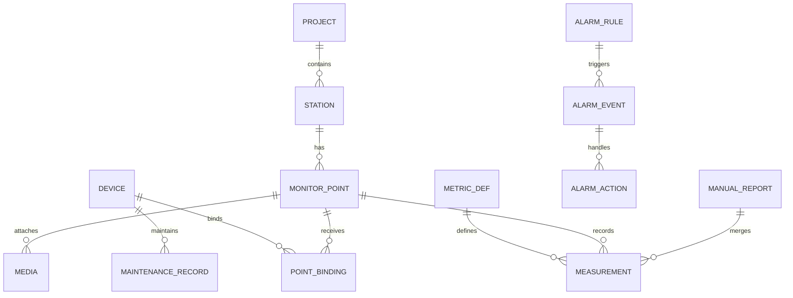

# 监测预警系统需求基线与总体技术方案（v0.2 · 已按权威基线修订）

> 文档目的：在进入分工和编码前，先回答两个问题——**到底要做什么**，以及**用怎样的整体框架实现**。
>
> 修订说明（v0.2）：本文以《软件系统框架搭建说明书_v1.0》（清远电厂科研项目地质灾害“天地一体化”监测预警系统）与《清远电厂科研项目技术规范书》第 3.3.5 节七项功能要求为**唯一权威依据**，对 v0.1 做了重定位。v0.1 的主要问题在于：把说明书 / 技术规范书**硬性规定的技术栈和“高”优先级核心功能自行降级或后置**，并把“天地一体化、空天地多源”的系统范围收窄成“只做雷达 + 照片上传”。本稿修正这三类偏离。凡标“待确认”的内容，未经项目负责人或实际用户确认，不应直接进入开发。

---

## 1. 本次审阅与依据材料

已完整审阅 / 以以下材料为基线：

1. **《软件系统框架搭建说明书_v1.0》** —— 本项目软件框架搭建的唯一权威依据（技术栈、七项功能需求、8 阶段搭建、里程碑均以此为准）。
2. **《清远电厂科研项目技术规范书》第 3.3.5 节** —— 监测软件七项功能要求的源头。
3. 《调研文档_通用监测管理系统》—— 通用监测平台调研与可行性，文中 FastAPI/TimescaleDB/React 等仅作**参考备选**，非执行依据。
4. 《技术文档_华测对标监测系统_20260907》—— 对标功能清单与难度评估。
5. 《点形变雷达_数据模型与标定》—— 雷达一手数据模型与场地标定。
6. 主线调研整理 / 交接文档（监测系统与雷达形变后台）—— 项目现状、雷达 Web 已具备能力、约定。

外部合规参考（不是重新定义需求，仅作约束参照）：广东省《DB44/T 2457—2024 地质灾害自动化监测规范》、《DZ/T 0442—2023 地质灾害监测预警数据库建设规范》、《DZ/T 0450—2023 地质灾害监测数据通信技术要求》。

> ⚠️ 关键口径：**技术栈与功能范围以《软件系统框架搭建说明书_v1.0》为准**；本文档中出现的任何“轻量备选”（FastAPI、TimescaleDB、React、Mosquitto）均不得作为偏离说明书的依据。

---

## 2. 项目正确定位

### 2.1 系统全称与核心定位

本项目是**清远电厂科研项目地质灾害“天地一体化”监测预警系统**。

> 一句话：以“**天地一体化**”为建设主线，构建覆盖“**空天地**”多源监测数据的采集、整合、分析、预警与决策支持平台；把无人机航拍、传统传感器、毫米波雷达、遥感影像、地形测绘与详勘成果、人工监测报表等多源数据**统一管理**，并在此基础上实现实时监控、多源融合、预警分析和专业报表输出。

本项目不是一个“只接点形变雷达的轻量演示”，而是要建成**覆盖空天地多源数据**的监测预警平台，只是**首个落地工程 = 清远电厂**、**首个真实数据源 = 公司毫米波雷达**。

### 2.2 系统建设范围（以说明书 1.2 为准）

**范围内（软件）**：监测数据接入、数据治理与融合、监测数据管理、预警分析、报表输出、可视化驾驶舱与系统支撑管理。

**范围外**：硬件选型、现场施工、通信网络物理建设；涉及系统衔接的只作简要说明。

### 2.3 平台与“通用”的关系

“通用 / 可扩展”体现为**领域模型、数据接口、模块边界可扩展**，而不是首版同时实现所有场景与设备。三个层次明确如下：

| 层次 | 本阶段含义 |
|---|---|
| 当前项目 | 清远电厂科研项目地质灾害“天地一体化”监测预警系统 |
| 首批真实能力 | 毫米波雷达 + 已有传统传感器（线性位移计/水位/测斜/GNSS 等）+ 人工监测报表融合 |
| 长期扩展方向 | 更多场景（铁路/边坡/矿山/其他工程）、更多传感器、遥感/地形/详勘成果深度应用 |

> v0.1 把范围收窄为“先只做点形变雷达 + 无人机照片上传”，偏离了说明书“空天地多源”的核心定位。本稿恢复为：**首批至少涵盖“雷达 + 传统传感器 + 人工报表”三类可落地数据，并把无人机航拍、遥感影像、地形测绘与详勘成果作为框架必须支撑的多源数据类型**（具体接入深度可在 P0/P1 划分，见 §6）。

### 2.4 首版不是单纯大屏，也暂不宣称“完整数字孪生”

首版核心是形成两条闭环：

1. **监测预警闭环**：设备/多源数据上报 → 数据校验与治理 → 时序/关系/空间入库 → 指标计算 → 规则触发 → **阈值联动加密采集** → 人工确认 → 处置/解除 → 全程留痕。
2. **运维与质量管理闭环**：设备/数据质量/系统运行异常 → 告警 → 运维处理 → 恢复确认 → 记录。

Cesium（3D）/ OpenLayers（2D）是空间化交互入口。若当前没有高精度地形、BIM、点云、动态仿真模型与模型状态同步，不宜把首版宣传为“完整数字孪生”，更准确的名称是“**三维/二维地理监测态势图**”。Cesium 负责 3D 与 2.5D，OpenLayers 负责 2D/离线地图与矢量交互；二者不必互相替换。

---

## 3. 功能主线 = 技术规范书 3.3.5 七项要求（优先级不可自行下移）

技术规范书第 3.3.5 节是**硬性功能要求**。下表把七项与说明书 §3.2 的模块、优先级对应起来；**“高”优先级项是框架搭建必须覆盖并留出业务扩展空位的**，v0.1 把其中多项降级或后置，需纠正。

| 编号 | 需求内容 | 对应功能要点 | 优先级 | 对应模块 |
|---|---|---|---|---|
| 3.3.5(1) | 区域级多工程管理驾驶舱 | 多工程、多站点统一管理，“一张图”总览 | 高 | 可视化/驾驶舱 |
| 3.3.5(2) | 实时数据概览 | 站点空间分布、主要监测指标、报警状态 | 高 | 可视化/驾驶舱 + 数据接入 |
| 3.3.5(3) | 多样数据整合与预警值叠加展示 | **对比、相关性、趋势预测分析图表** | 高 | 数据治理与融合 + 可视化 |
| 3.3.5(4) | **超阈值自动加密其他传感器采集频率并上报** | 阈值联动、采集频率动态调整、自动上报 | **高（核心特色）** | 预警引擎 |
| 3.3.5(5) | 人工监测与自动化监测融合管理，支持人工导入报表 | 人工报表导入、与自动化数据融合 | 中 | 数据接入 + 数据治理 |
| 3.3.5(6) | 专业监测数据报表输出 | 按日/周/月/年一键输出，自定义起始时间看形变 | 高 | 报表模块 |
| 3.3.5(7) | 全天候实时动态展示，多源异构数据结构化/非结构化应用 | WebSocket 实时流式 + 时序/影像/报表混合展示 | 高 | 可视化/驾驶舱 + 数据接入 |

> **特别强调 3.3.5(4)（阈值联动加密采集）**：这是说明书里唯一的“回控/联动”能力，是监测预警系统的关键差异化。v0.1 把它弱化为“P1 再做设备远程调频”，属于对硬性要求的降级。它应在**预警引擎模块**首版即具备规则引擎，并通过 **MQTT/Kafka 指令下发**调整相关传感器采集频率。

---

## 4. 数据与非功能需求（以说明书 2.2 / 2.3 为准）

### 4.1 数据需求（三类，缺一不可）

| 类别 | 内容 |
|---|---|
| 结构化 | 各传感器时序监测数据；工程、监测站点、监测指标、阈值、报警、用户等关系数据 |
| 空间 | 监测站点坐标、监测区域边界、灾害隐患点分布等地理空间信息 |
| 非结构化 | 遥感影像、地形图、无人机航拍影像、详勘报告、人工监测报表文件等 |

### 4.2 非功能需求（用数字定义，不能再以“高并发/实时/海量”代替）

| 项 | 说明书要求 | 备注 |
|---|---|---|
| 实时性 | 采集到界面展示 ≤ 1 秒；预警延迟 ≤ 5 秒 | 秒级 |
| 可用性 | 7×24 连续运行；关键模块具备故障恢复与数据容灾 | 无故障运行 + 容灾 |
| 安全性 | 用户认证与分级授权（RBAC）；传输加密（HTTPS/TLS）；满足电力行业信息安全要求 | 等保 / 电力行标 |
| 可扩展性 | 支持新增工程、站点、传感器、数据源；可面向多项目复制部署 | 多工程/多站点是硬需求 |
| 易用性 | Web 端，支持主流浏览器 | B/S |

### 4.3 用户与角色

| 角色 | 核心诉求 | 典型权限 |
|---|---|---|
| 系统管理员 | 账号、角色、字典、系统参数 | 系统配置与全局审计 |
| 工程项目管理员 | 建工程、站点、传感器、点位、指标、阈值与规则 | 项目内配置与授权 |
| 值班监测人员 | 看实时、接收并确认警情 | 查看、确认、填写处置 |
| 专业研判人员 | 复核曲线、照片、报表与宏观现象 | 调整研判、建议升级/解除 |
| 运维人员 | 处理设备离线/低电量/数据异常 | 设备状态、工单、维护记录 |
| 领导/访客 | 查看态势与统计，不改数据 | 项目只读 |
| 设备/边缘网关 | 上报数据、状态，接收受控命令（含频率调整） | 仅设备接口，独立认证 |
| 外部系统 | 查询或接收授权数据与警情 | API 级授权 |

RBAC 之外还需**数据范围权限**：用户只能访问被授权的工程或区域。

---

## 5. 技术栈（以说明书 §4.2 为准，禁止擅自降级或替换）

> 说明：下列为**目标技术栈**，是框架搭建说明书的硬约束。是否“首版全量上齐”可以在排期上说明，但**不能把目标栈从说明书里删掉或改成自选轻量方案**。

| 技术领域 | 技术选型（说明书 §4.2） | 用途与说明 |
|---|---|---|
| 前端框架 | Vue 3 + TypeScript | 组件化开发，生态完善 |
| UI 组件 | Element Plus | 中后台组件，中文友好 |
| 可视化 | ECharts | 对比、相关、趋势预测图表 |
| 地图/GIS | **OpenLayers / Cesium** | 2D 站点分布 + 3D 态势，两者并存 |
| 后端框架 | Spring Boot 3 (Java 17) | 业务主后端 |
| 微服务治理 | **Spring Cloud Alibaba (Nacos)** | 注册中心与配置中心，服务分组管理 |
| 算法服务 | **Python 3.11 + FastAPI** | 数据融合、趋势预测、模型训练与回测 |
| 数据处理 | Pandas / NumPy / scikit-learn | 清洗、融合、分析建模 |
| 关系数据库 | PostgreSQL + PostGIS | 业务 + 空间数据 |
| 时序数据库 | TDengine / InfluxDB | 高频监测数据与聚合查询 |
| 缓存 | Redis | 会话、热点、预警缓存 |
| 对象存储 | MinIO | 遥感影像、报表、附件等非结构化数据 |
| 消息/接入 | **EMQX (MQTT) + Kafka** | 海量设备接入、异步解耦、削峰填谷 |
| 实时推送 | WebSocket | 动态数据与报警实时刷新 |
| 接口规范 | RESTful API + OpenAPI | 前后端契约，文档化 |
| 部署运维 | Docker + Kubernetes + Nginx | 容器化、弹性伸缩、反向代理与 HTTPS |
| 持续集成 | GitLab CI / Jenkins | 自动构建、测试、发布 |
| 安全 | JWT/OAuth2 + RBAC + HTTPS | 认证授权、分级权限、传输加密 |

**说明书的几条技术说明（§4.3），必须体现在设计中：**
- 时序处理：时序库用“标签 + 超表”，提供按时间维度快速聚合。
- 空间处理：基于 PostGIS 与地图组件实现站点、区域、隐患点的空间分析与可视化。
- 多源融合：借助算法服务对结构化/非结构化数据清洗、对齐、融合，支撑对比/相关/趋势分析。
- 预警联动：预警规则引擎结合消息下发（MQTT/Kafka），实现超阈值后对其他传感器采集频率的动态加密上报。

> **v0.1 的偏离点**：v0.1 §2.3/§13/§14 主张“模块化单体、先不用 Spring Cloud 微服务 / Kafka / Redis / K8s，只用 JWT 不用 OAuth2，只用 Cesium 去掉 OpenLayers，Python 只做算法不做业务后端”。这些与说明书 §4.2 冲突。修正为：**以上述技术栈为基线**；可在实现策略上说明“首版以单体 + 单实例起步、但保留模块化边界与 Nacos/Kafka/Redis/K8s 的接入位”，而不是从目标栈里删掉。

---

## 6. 分阶段功能需求

> 分 P0/P1/P2 的目的是**控制交付节奏**，但任何“高”优先级项必须在**首版框架**内体现业务空位；P0/P1 只是“先完整实现哪条链路”，不是“把哪些硬性要求删掉”。尤其 3.3.5(4) 阈值联动、3.3.5(3) 三类分析、3.3.5(6) 报表、3.3.5(1) 多工程驾驶舱，都是高优先级，不能因“两/三人团队”而砍到后置。

### 6.1 P0：最小可交付闭环（覆盖 3.3.5 全部七项的业务空位）

#### A. 登录、权限与审计
- 用户登录/退出/改密；用户、角色、菜单/操作权限；按工程的数据范围权限；关键配置与警情操作审计。
- 对应技术：Spring Security + JWT（可再升级 OAuth2）+ RBAC + HTTPS；可扩展至 Nacos 配置中心。

#### B. 多工程与空间档案
- **区域级多工程管理驾驶舱**：多工程、多站点“一张图”总览。
- 工程、监测区域/分区、监测站点、监测指标的增删改查；站点坐标、海拔、照片、状态与基础说明。
- 2D（OpenLayers）/3D（Cesium）态势图展示区域、设备、测点；点击查看最新值、曲线、警情、照片。

#### C. 设备与绑定
- 设备类型、型号、编号、协议、安装位置、运行状态；设备与监测点/测项绑定；上线/离线/最近通信/低电量；安装、标定、维护记录。

#### D. 数据接入（雷达 + 传统传感器 + 人工报表 + 多源文件）
- **毫米波雷达**：复用现有雷达后端解析/算法结果，不在平台重写算法；通过标准消息封装接收 `seq/angle/distance/signal/state/cumulative_defo_mm` 等。
- **传统传感器适配**：为线性位移计、水位计、测斜计、GNSS 等预留协议插件，先按统一模板接入 1~2 种验证。
- **人工监测报表导入**：Excel 模板校验、入库，与自动化数据融合（3.3.5(5)）。
- **非结构化数据接入**：无人机航拍影像、遥感影像、地形图、详勘成果的批量导入、预览与空间/对象关联（对象存储 + 元数据入库）。
- 记录设备时间、平台接收时间、消息序号与原始报文引用；支持模拟器和真实设备两种输入。

#### E. 数据处理与治理（数据治理与融合模块）
- 设备/消息/字段合法性校验；设备 ID + 消息 ID/序号 + 采集时间幂等去重；单位统一与质量标记。
- 标记迟到、缺失、重复、越界、粗差、设备异常；原始值与修正/派生值分开保留。
- 多源融合：自动化与人工/环境数据、结构化与非结构化数据统一编码与时空对齐。
- 展示在线率、完整率、延迟、异常数据数量；异常数据隔离并告警。

#### F. 时序查询与实时展示
- 最新数据列表；按工程、区域、测点、指标与时间范围查询；累计形变与形变速率曲线。
- 实时数据与警情 WebSocket 推送；CSV/报表导出。
- 规范要求变形类成果至少含**累计变形时程曲线 + 变形速率曲线**，不能只显示累计值。

#### G. 预警引擎 + 阈值联动（3.3.5(4)）
- 支持累计值、变化量、速率、持续时间等可解释规则；规则含适用对象、级别、时间窗口、触发阈值、恢复阈值、重复抑制、启停状态。
- 达到阈值生成警情；同规则同对象避免重复刷屏；等级升高能升级。
- **超阈值自动加密其他传感器采集频率并上报**：规则引擎 + MQTT/Kafka 指令下发，动态调整关联传感器采集频率（核心，不可后置）。
- 支持确认、研判、误报标记、派发、处置、降级、解除；每次动作记录操作人、时间、意见、附件。
- 监测预警与数据质量告警/设备故障告警/系统运行告警分开管理。
- 阈值应由地质/监测专业人员提出并确认，开发负责可靠实现；未经确认不自行设灾害阈值。

#### H. 报表中心（3.3.5(6)）
- 按日/周/月/年**一键输出**；支持自定义起始时间查看形变数据；模板化报表；专业报表导出。

#### I. 部署与恢复（Docker + Kubernetes + Nginx）
- Docker Compose 启动开发/试点环境；配置、日志、数据库、文件分卷持久化；数据备份与一次可验证的恢复演练；健康检查与基础运行日志；具备向 K8s 演进与容灾的接入位。

### 6.2 P1：首版稳定后增强

- 更多传感器协议（水位/雨量/GNSS/测斜/雷视哨兵等）；更多场景。
- 无人机照片 EXIF/RTK 自动解析与邻近测点推荐；遥感/详勘成果的空间化应用深化。
- 多传感器更多指标的三类分析（对比/相关/趋势预测）增强（Python 算法服务：Pandas/NumPy/scikit-learn 建模与回测）。
- 邮件、短信、企业微信、声光等外部通知；完整运维工单；上级平台/第三方系统接口。
- 多工程复制部署、数据范围权限增强；规则组合、多指标联动的数据质量策略。

### 6.3 P2：明确业务价值后再做

- 铁路里程/桩号等新场景坐标适配坐标适配器；多传感融合风险评估模型；机器学习深度趋势预测。
- 无人机自动调度、正射影像、点云、多期三维变化检测；高精度三维模型/BIM/点云“完整数字孪生”。
- 多租户 SaaS、大规模微服务治理深化、复杂容灾与集群。

---

## 7. 总体架构（以说明书 §3 分层 + §3.2 模块划分为准）

说明书 §3.1 分层架构（自下而上）：**感知层 → 传输层 → 数据层 → 服务层 → 应用层**；§3.2 模块划分：数据接入 / 数据治理与融合 / 监测数据管理 / 预警引擎 / 报表 / 可视化驾驶舱 / 系统管理。

```mermaid
flowchart TB
    subgraph FIELD[感知层·现场]
        RADAR[毫米波雷达] ; SENSOR[传统传感器] ; UAV[无人机/遥感/详勘] ; MANUAL[人工监测报表]
    end

    subgraph TRANS[传输层]
        MQTT[EMQX/MQTT] ; KAFKA[Kafka 消息总线] ; HTTP[/对象存储/文件导入]
    end

    subgraph DATA[数据层]
        PG[(PostgreSQL+PostGIS)] ; TD[(TDengine/InfluxDB)] ; OBJ[(MinIO 对象存储)]
    end

    subgraph SVC[服务层·Spring Boot 3 模块 + 算法服务]
        INGEST[数据接入] ; GOVERN[数据治理与融合] ; MGMT[监测数据管理]
        ALARM[预警引擎] ; REPORT[报表] ; VIZ[可视化/驾驶舱] ; SYS[系统支撑管理]
    end

    subgraph APP[应用层]
        UI[Vue3+Element Plus+ECharts] ; MAP[OpenLayers/Cesium] ; DASH[驾驶舱/大屏]
    end

    FIELD --> MQTT --> KAFKA --> INGEST
    FIELD --> HTTP --> OBJ
    INGEST --> DATA
    GOVERN --> PG & TD
    MGMT --> PG
    ALARM --> PG & TD
    REPORT --> PG
    UI --> VIZ
    ALARM -- WebSocket --> UI
    ALARM -- 指令下发(频率调整) --> MQTT
```

**关键数据流**（说明书 §3.3）：传感器与雷达数据经 MQTT 接入写入 Kafka 消息总线 → 数据接入服务消费 → 数据治理与融合服务清洗/校验/对齐 → 写时序库与关系库 → 服务层基于统一数据接口供数；实时数据经 WebSocket 推前端；预警结果经预警引擎推送；**超阈值时经消息下发加密其他传感器采集频率**；人工报表/影像经文件导入进入数据治理流程与自动化数据融合。

---

## 8. 后端架构：以说明书为基线，模块化单体起步 + 保留微服务接入位

### 8.1 架构策略

说明书技术栈为 Spring Boot 3 + **Spring Cloud Alibaba (Nacos)**。为兼顾“两三人团队”的落地节奏，**首版可先以单体 + 单实例起步**（便于开发与演示），但必须：

- 按业务能力**模块化拆包**（包级边界、公开接口/领域事件交互，参考 Spring Modulith 的“可验证模块化单体”思路）。
- 保留 **Spring Cloud Alibaba / Nacos**（注册中心 + 配置中心）接入位：多环境配置从 Nacos 读，服务可平滑拆分为多模块服务。
- 为 **Kafka / Redis / K8s / MinIO / OAuth2** 预留集成配置与抽象接口，首版即按说明书技术栈落地，而非替换成“自制轻量方案”。

> 修正 v0.1：v0.1 主张“暂不默认采用 Spring Cloud 微服务、Kafka、Redis、K8s”，这与说明书硬性选型冲突。本稿改为“**以说明书技术栈为基线；实现上首版单体起步，保留微服务/消息/缓存/编排接入位**”，而不是删掉目标栈。

### 8.2 建议模块（对应说明书 §3.2 七模块 + 业务能力）

```text
com.company.monitoring
├── auth              认证、用户、角色、数据权限（JWT/RBAC，可升级 OAuth2）
├── project           工程、隐患区域、组织关系（多工程/多站点）
├── asset             传感器/设备、类型、绑定、维护记录
├── spatial           监测点、坐标、标定、空间查询（PostGIS）
├── telemetry         接入、指标定义、时序查询（TDengine）+ 标准消息
├── governance        数据治理、质量、多源融合、时空对齐
├── alarm             预警规则、警情状态机、处置、阈值联动频控
├── inspection        人工巡查、人工比测、宏观现象、报表导入
├── media             影像/报表/附件元数据（对象存储键）
├── report            日/周/月/年报表、导出、统计
├── integration       MQTT、Kafka、外部 API、对象存储、指令下发适配
├── realtime          WebSocket 推送
└── audit             操作与配置审计
```

### 8.3 Python 算法服务（说明书明确要求，不是“第二套业务后端”）

说明书 §4.2 明确 **Python 3.11 + FastAPI + Pandas/NumPy/scikit-learn** 承担**数据融合、趋势预测、模型训练与回测**。因此 Python 不是“可选项”，而是算法/数据服务层。定位：

- 数据融合与时序对齐（结构化/非结构化）；
- 数据趋势预测分析（3.3.5(3)）；
- 多源融合、风险/预警模型训练与回测（P1/P2）；
- 现有雷达解析与信号处理引擎的独立运行。

Java 后端负责业务事实与状态，Python 服务负责算法结果；二者通过**版本化消息/API 契约**连接，不直接共享数据库表。

---

## 9. 核心业务对象（映射说明书：工程/站点/传感器/指标/阈值/报警/人工报表/用户角色/参数）



关键对象解释（术语对齐说明书：“工程/站点/传感器/监测指标/阈值/报警”）：

| 对象 | 对应说明书概念 | 说明 |
|---|---|---|
| Project | 工程 | 交付/运营工程，如清远电厂；**多工程**是一等需求 |
| Station / HazardSite | 监测站点/隐患区域 | 站点、隐患点/区域、监测分区；不等同于传感器测点 |
| Device | 传感器/设备 | 物理设备档案、协议、序列号、在线/电量/故障状态 |
| MonitorPoint | 监测点/测点 | 业务上的监测位置，可绑定一个或多个设备/测项 |
| MetricDefinition | 监测指标 | 累计形变、速率、位移、水位、雨量等及其单位 |
| Measurement | 监测数据 | 某测点某指标某时刻的值与质量标记（时序库） |
| CalibrationProfile | 标定/坐标系 | 标定参数、坐标系、版本、有效期、误差说明 |
| AlarmRule | 阈值/规则 | 指标、时间窗口、阈值、等级、恢复条件、抑制、**频控联动** |
| AlarmEvent | 报警/警情 | 一次实际警情，有等级与生命周期 |
| AlarmAction | 处置/动作 | 确认、研判、升级、降级、派发、处置、解除 |
| Inspection | 人工监测/巡查 | 人工监测、人工比测、宏观现象记录 |
| ManualReport | 人工报表 | 人工导入的报表，与自动化数据融合（3.3.5(5)） |
| Media | 非结构化数据 | 遥感影像、航拍、地形、详勘、现场照片、报告附件 |
| MaintenanceRecord | 运维记录 | 安装、调试、标定、维修、更换、恢复记录 |

---

## 10. 坐标与标定需求（对齐《点形变雷达_数据模型与标定》）

“坐标/标定可切换”不只是前端地图按钮，而是可追溯的数据模型。每个位置至少保存：原始坐标值、原始坐标系/参考系、转换后的平台标准坐标、高程及高程基准、转换/标定方法、标定参数版本/有效时间/操作人/精度说明。

**毫米波雷达首版流程（既有资产直接复用）：**

> 雷达站点坐标 + 站点方位角(bearing) + 目标极坐标(angle, distance) → 局部 ENU 坐标 → 地理坐标 → PostGIS 空间点 → OpenLayers/Cesium 展示。

雷达数据模型（一手事实，接口 Schema 直接对齐）：每目标 `seq / angle / distance / signal / state / monitored` + `cumulative_defo_mm`（累计形变 mm）+ `history` 曲线；场地标定 `site_calib = { lat, lng, bearing, zoom }`；**目标地图坐标 = 站点经纬度 + bearing + 目标(angle, distance)**。

> ⚠️ 雷达 = **点形变（单测点累计形变 + 地图标点）**，不是 GB-InSAR 面形变/形变场热力图。这是能力边界，代码补不了，需如实向了解情况的人说明。

铁路等新场景以后增加 `RailwayChainageAdapter`（线路 ID、里程/桩号、横向偏移、高程 → 标准空间位置），不应让铁路字段侵入边坡/电厂首版核心表。

---

## 11. 数据接入契约（标准消息）

平台接收的标准消息至少包括（参考雷达 schema + 说明书“统一编码”），并承载“空天地多源”语义：

```json
{
  "schemaVersion": "1.0",
  "messageId": "unique-id",
  "deviceId": "radar-001",
  "metricCode": "cumulative_deformation",
  "collectTime": "2026-09-09T10:00:00.000+08:00",
  "receiveTime": "2026-09-09T10:00:01.210+08:00",
  "sequence": 12345,
  "value": 2.36,
  "unit": "mm",
  "quality": "RAW",
  "position": { "angleDeg": 15.2, "distanceM": 87.4 },
  "attributes": { "signal": 0.91, "state": "normal" },
  "sourceType": "SENSOR"
}
```

需遵守：
- 采集时间与接收时间分开；`schemaVersion` 明确消息结构版本；数值与单位分开；设备唯一标识不依赖展示名称。
- 原始消息可追溯；重复消息不重复生成数据与警情（幂等）。
- 不同协议适配器只负责转换为标准消息，不直接写业务表。
- 人工报表/影像用文件 + 元数据标准模板进入平台（3.3.5(5)），并保留原始文件与处理结果的关系。

---

## 12. 必须确认的非功能数字（说明书已给定部分，其余待负责人确认）

说明书已给出：实时性（展示 ≤1s / 预警 ≤5s）、可用性（7×24 + 故障恢复 + 容灾）、安全（RBAC + HTTPS/TLS + 电力行业信息安全）。以下项目仍需负责人填写明确数字：

| 编号 | 待确认指标 | 示例口径 |
|---|---|---|
| NFR-01 | 首批工程数、站点数、点位数 | 多工程 ___，站点 ___，测点 ___ |
| NFR-02 | 各设备上报频率 | 常态 ___，警情态 ___（含阈值联动加密后） |
| NFR-03 | 峰值消息量 | ___ 条/秒，单条 ___ KB |
| NFR-04 | 数据保存年限 | 原始 ___ 年，聚合 ___ 年（时序库） |
| NFR-05 | 实时延迟 | 采集到页面 P95 小于 ___ 秒（说明书目标 ≤1s） |
| NFR-06 | 并发用户 | 在线 ___ 人，查询 ___ QPS |
| NFR-07 | 可用性 | 试点 ___%，正式运行 ___%（说明书 7×24） |
| NFR-08 | 断网补传 | 边缘缓存至少 ___ 小时/天 |
| NFR-09 | 部署位置 | 厂内网/政务云/公有云/混合（影响是否支持离线地图） |
| NFR-10 | 安全合规 | 等保级别、TLS、密码与审计周期、电力行业信息安全 |
| NFR-11 | 地图与三维数据 | 数据来源、坐标系、离线要求、授权（Cesium/OpenLayers 数据源） |
| NFR-12 | 备份恢复 | RPO ___，RTO ___ |
| NFR-13 | 阈值联动范围 | 超阈值后需加密哪些传感器、频率到多少、如何上报 |

在这些数字确认前，无法严肃判断集群规模、Kafka 分区数、Redis 容量、K8s 资源等具体参数是否合理。

---

## 13. 软件开发框架搭建（以说明书 §5 八阶段 + §7 里程碑为准）

### 13.1 八阶段（框架搭建需在“合同签订后 15 天内”完成）

| 阶段 | 目标 | 产出物 |
|---|---|---|
| ① 环境与工程准备 | 统一开发/运行环境 + 依赖版本锁定 | 可复现环境、代码仓库、依赖版本清单 |
| ② 工程骨架初始化 | 前后端分离、可空跑的多模块骨架 | 后端(Spring Boot+Maven) / 前端(Vue3+Vite) / 算法(FastAPI) 骨架 |
| ③ 基础框架 | 统一响应/异常/日志、配置中心、JWT+RBAC、MyBatis-Plus、前端路由/Pinia/axios、算法服务输入输出 | 可登录、统一日志与异常处理的完整前后端 |
| ④ 数据模型与存储设计 | 关系/空间/时序/对象 四类存储建模 | 数据库设计文档、建表脚本、测试数据 |
| ⑤ 数据接入框架 | 打通雷达、传感器、人工报表、影像多源接入 | 可接收并入库的多源接入模块 |
| ⑥ 数据治理与融合服务 | 清洗/校验/融合 + 标准化数据接口 | 治理与融合服务、标准化接口 |
| ⑦ 预警与业务功能框架 | **覆盖 3.3.5 全部七项** | 业务功能框架（含阈值联动、报表、驾驶舱） |
| ⑧ 联调、部署与验收准备 | 全链路验证、容器化、CI/CD、性能安全 | 可运行的框架版本、部署/运维文档、验收材料 |

### 13.2 里程碑（说明书 §7）

合同签订后：**15 天**框架搭建（本说明书范围）→ **100 天**设备安装调试 + 通信网络 + 软件开发 → **180 天**阶段成果 + 预警模型训练 + 优化联调 → **250 天**模型优化 + 软著/技术报告 + 系统验收 → **280 天**人员培训 + 正式运行 → **365 天**运维服务。

---

## 14. 首版验收场景（结合说明书 7 项与数字化指标）

以下场景比“页面做完”更适合作为验收依据：

1. 模拟器/真实雷达连续上报，平台能识别设备、落库并在测点页面实时刷新（含 2D/3D 空间点位）。
2. 相同消息重复发送，不产生重复测量值与重复警情（幂等）。
3. 数据延迟/缺失/设备断联时，能标记质量问题并生成对应设备/数据告警。
4. 累计形变或速率达到阈值时生成警情；持续超限不刷屏，等级升高能升级。
5. **某传感器超阈值后，平台能自动加密其他关联传感器的采集频率并上报（3.3.5(4)）。**
6. 值班人员确认警情、专业人员研判、运维处置，最终可解除并完整追溯；人工导入报表后能与自动化数据融合展示。
7. 在 2D/3D 中点击测点能看到最新值、历史曲线、警情、照片与报表。
8. **按日/周/月/年一键输出专业报表，并能自定义起始时间查看形变数据（3.3.5(6)）。**
9. 普通用户无法访问未授权工程；关键配置修改有审计记录。
10. 服务重启后业务数据不丢失；执行备份恢复后能查询历史、警情与附件索引。
11. 更换一个协议适配器或新增一个模拟传感器时，不修改工程、警情与前端核心模型（可扩展性）。
12. 实时性满足“采集到页面 ≤1s、预警 ≤5s”，可用性满足 7×24 与数据容灾设计。

---

## 15. 当前必须向负责人确认的问题

### A. 项目性质与范围
1. 是否即为《软件系统框架搭建说明书_v1.0》所指“清远电厂科研项目地质灾害‘天地一体化’监测预警系统”？是否已有《技术规范书》全文、合同/招标参数与验收说明？
2. 首批覆盖哪些工程/站点？是单工程试点还是**多工程、多站点驾驶舱**（3.3.5(1)）？
3. 首版是否必须现场运行，还是可用模拟/历史数据演示？

### B. 设备与数据（空天地）
4. 首批真实接入哪些传感器，数量、上报频率多少？
5. 毫米波雷达输出的是原始 TCP 帧、算法结果，还是二者都要保存？现有雷达引擎由谁维护，接口与部署环境？
6. 断网时现场端是否缓存补传？平台是否需下发调频/启停命令（3.3.5(4) 指令下发通道）？
7. **无人机航拍、遥感影像、地形图、详勘成果**是否需要首批接入？数据源、格式、经纬度/RTK/坐标系与命名规则？
8. 人工监测报表用什么 Excel 模板，栏目与时间粒度如何？

### C. 预警联动（3.3.5(4)）
9. 谁制定/批准阈值？采用几级、什么颜色、什么通知方式？
10. 某传感器超阈值后，需自动加密**哪些**其他传感器的采集频率、加密到多少、如何上报、如何恢复？链路（MQTT/Kafka 下发）已具备吗？
11. 谁确认、谁研判、谁有权升级/降级/解除？是否需要短信/电话/声光/上报主管平台？

### D. 空间与展示
12. 是否已有地形、正射影像、倾斜摄影、BIM 或点云数据？坐标系（CGCS2000/WGS84/地方/厂区独立）？地图是否要求离线？
13. “2D + 3D”是硬性验收项，还是任一可切换空间视图即可（说明书 OpenLayers/Cesium）？

### E. 部署、安全与合规
14. 部署在厂区内网、公司服务器还是云端？能否联网加载地图？
15. 是否要求等保、国产化、信创、中间件指定品牌（Nacos/Kafka/TDengine/Redis/MinIO 等）或开源许可证审查？
16. 外部标准（DB44/T、DZ/T）是否作为验收依据，还是仅作参考？

---

## 16. 建议下一步（不进入编码）

1. 获取并审阅《软件系统框架搭建说明书_v1.0》全文、《技术规范书》3.3.5/第 4 章、合同/验收材料、真实协议与样例数据。
2. 由项目负责人回答第 15 节问题，优先确认：项目性质、**空天地数据范围**、首批设备、**阈值联动加密采集（3.3.5(4)）**、报表（3.3.5(6)）、多工程驾驶舱（3.3.5(1)）与部署环境。
3. 将本稿修订为正式《需求规格说明书 v1.0》，为每项需求赋予编号、优先级、角色、前置条件、验收标准（对齐说明书 3.3.5 与 §6 需求实现对照表）。
4. 基于确认需求完成领域模型、数据库概念设计（PG/TDengine/MinIO）、接口契约与页面原型。
5. 按说明书 §5 八阶段启动框架搭建，再讨论两人分工、代码仓库、迭代计划与实现。

---

## 17. 最终决策摘要（v0.2 修正后）

| 决策项 | 修正后结论 |
|---|---|
| 项目定位 | 清远电厂科研项目地质灾害“天地一体化”监测预警系统；架构可扩展但首批聚焦电厂落地 |
| 数据范围 | **空天地多源**：毫米波雷达 + 传统传感器 + 人工监测报表（首批真实接入）；无人机航拍/遥感影像/地形/详勘成果（框架必须支撑，接入深度按 P0/P1 划分） |
| 核心特色功能 | **3.3.5(4) 超阈值自动加密其他传感器采集频率并上报（不可后置）**；3.3.5(3) 对比/相关/趋势预测分析；3.3.5(6) 日/周/月/年报表；3.3.5(1) 多工程驾驶舱 |
| 核心闭环 | 多源接入与治理 → 展示 → 预警（含频控联动）→ 人工研判/处置 → 报表/运维/审计 |
| 3D/2D 定位 | 三维/二维地理监测态势图；三维=Cesium，二维/离线=OpenLayers；暂不宣称“完整数字孪生” |
| 后端 | Spring Boot 3 (Java 17)，**保留 Spring Cloud Alibaba (Nacos)** 接入位；首版可模块化单体起步 |
| 算法服务 | **Python 3.11 + FastAPI + Pandas/NumPy/scikit-learn**，承担数据融合、趋势预测、模型训练与回测；不作第二套业务后端 |
| 前端 | Vue 3 + TypeScript + Element Plus + ECharts + OpenLayers/Cesium |
| 数据 | PostgreSQL/PostGIS（关系+空间）+ **TDengine/InfluxDB**（时序）+ **MinIO**（对象） |
| 接入 | **EMQX (MQTT) + Kafka** 消息总线 + 协议适配器输出版本化标准消息 + 文件/影像导入 |
| 部署 | **Docker + Kubernetes + Nginx**；CI/CD（GitLab CI/Jenkins）；**Redis** 缓存；**JWT/OAuth2 + RBAC + HTTPS** |
| 开发前置条件 | 获取技术规范书/说明书/合同/验收材料、真实协议与样例数据，确认第 15 节问题 |

---

> **总结（v0.1 → v0.2 修了什么）**：① 定位从“清远电厂地灾 V1 + 只做雷达照片”修正为“清远电厂科研项目地质灾害‘天地一体化’监测预警系统（空天地多源）”；② 技术栈从“两三人团队自选轻量（单体、免微服务/Kafka/Redis/K8s、只用 Cesium、JWT 即可）”修正为“以《软件系统框架搭建说明书_v1.0》§4.2 为准（Spring Cloud Alibaba、EMQX+Kafka、Redis、MinIO、Python 算法服务、OpenLayers+Cesium、JWT/OAuth2）”；③ 功能从“把高优先级核心项后置/遗漏”修正为“对齐 3.3.5 七项，尤其恢复 3.3.5(4) 阈值联动加密采集、3.3.5(3) 三类分析、3.3.5(6) 报表、3.3.5(1) 多工程驾驶舱、3.3.5(5) 人工报表融合”。
