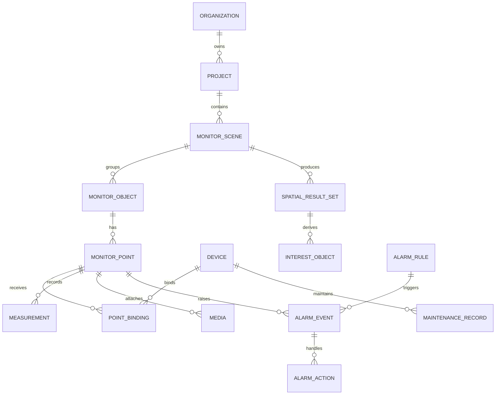
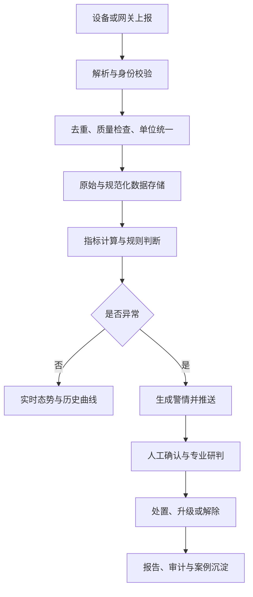
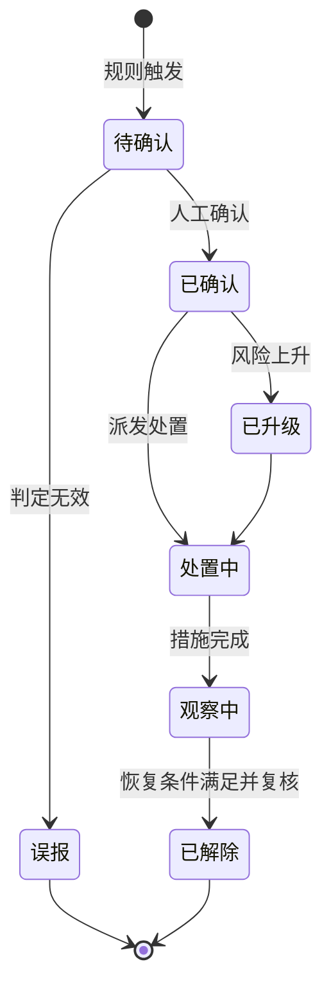
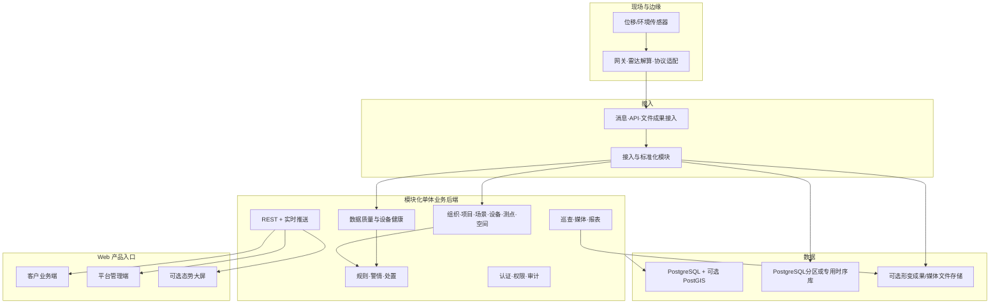

# 通用监测管理系统需求基线与总体技术方案（v0.5·客户产品版）

> 文档目的：在进入分工和编码前，先回答两个问题：**到底要做什么**，以及**用怎样的整体框架实现**。
>
> 当前状态：需求澄清稿，不是最终需求规格说明书。凡标记为“待确认”的内容，未经项目负责人或实际用户确认，不应直接进入开发。

## 1. 本次审阅范围

已完整审阅以下材料：

1. 《调研文档_通用监测管理系统.md》
2. 《技术文档_华测对标监测系统_20260907.md》
3. 《新对话提示词_学习SpringBoot_20260908.md》
4. 参考视频《火电机组全状态反馈优化运行辅助系统》（约 4 分钟）
5. 华测网页展示视频《系统平台》（约 27 秒）
6. 华测网页展示视频《全方位固定式地基》（约 3 秒）

同时查阅了华测边坡/地灾监测公开方案、广东省现行《DB44/T 2457—2024 地质灾害自动化监测规范》、自然资源行业相关标准目录，以及 Spring Boot、TDengine、PostGIS、EMQX、CesiumJS 的官方资料。行业方案用于扩充候选需求，产品文档用于核实候选技术的能力边界，二者均不构成本项目的既定需求或指定技术栈。

### 案例使用原则

本文出现的清远电厂、火电机组展示系统、华测平台、公司既有雷达系统及其他现有项目，**全部只是参考案例**：

- 可以帮助发现行业中可能存在的对象、功能、界面模式和风险；
- 可以用于提出待确认问题和备选方案；
- 不能直接转化为本项目必须实现的功能；
- 不能把案例采用的架构、中间件、数据库或前端框架直接指定为本项目技术栈；
- 不能因为案例没有展示某项功能，就认定本项目不需要该功能；
- 最终需求只来自本项目真实目标、用户、流程、数据、约束和验收标准。

案例之间可以有不同参考权重。根据当前项目方补充说明，**华测 PS-SAR2000 多点位移监测系统是现阶段第一优先级对标案例**：其 UI 组织、监测结果呈现方式和功能覆盖与本项目预期大体相似。这里的“对标”表示优先研究和逐项确认，不表示复制产品、照搬页面，也不表示继承华测的设备方案、算法实现或技术栈。

## 2. 先给结论

### 2.1 项目应如何重新定位

现有案例覆盖电厂、地质灾害、铁路、边坡、料位和微形变等多个方向，反而证明现在不能把任一案例当作项目本身。当前最稳妥的项目定位是：

> **建设一套面向客户使用、以多点位移/微形变监测为首要业务原型、可扩展到其他监测对象和传感设备的监测管理产品。产品以客户业务端为主要使用入口，同时提供平台管理端支撑客户、项目、设备、数据和权限配置；V1 优先围绕多点位移监测验证完整闭环，最终仍以本项目真实用户、设备、数据和验收要求为准。**

这句话包含三个层次：

| 层次 | 本阶段含义 |
|---|---|
| 业务主线 | 多点位移/微形变监测是当前最接近真实需求的首要业务原型 |
| 产品形态 | 面向客户的业务产品，不是仅供内部人员使用的后台系统 |
| 通用平台 | 从业务主线中抽取不绑定具体行业的监测共性能力 |
| V1 试点 | 优先选择能够提供真实协议和样例数据的多点位移场景及设备跑通闭环 |
| 主对标案例 | 华测 PS-SAR2000 用于重点对照 UI、信息组织、呈现方式和候选功能 |
| 补充案例库 | 清远电厂、火电运行展示、铁路/边坡等只用于补充候选需求与澄清问题 |
| 后续扩展 | 在试点成功后按真实业务接入其他传感器和场景 |

“通用”应表现为领域模型、数据接口和模块边界可扩展，而不是首版同时实现所有场景与设备。

### 2.2 首版不是单纯的大屏、内部后台或完整数字孪生

首版核心价值是形成两条业务闭环：

1. **监测预警闭环**：设备上报 → 数据校验 → 时序存储 → 指标计算 → 规则触发 → 人工确认 → 处置/解除 → 全程留痕。
2. **设备运维闭环**：设备状态/数据质量异常 → 故障告警 → 运维处理 → 恢复确认 → 维护记录。

三维只是候选的空间化交互方式，不是首版默认要求。只有本项目确认存在空间定位、模型资产和明确验收价值时，才建设“**三维监测态势图**”；若只是普通设备管理与曲线查询，则二维地图甚至无地图的管理界面更合适。即使启用三维，在没有高精度地形、BIM、点云、动态仿真模型和模型状态同步时，也不应称为完整“数字孪生”。CesiumJS 可作为地理三维场景的候选引擎，因为它支持 3D、2D、地形、影像、3D Tiles、glTF 模型、动态数据与交互。[CesiumJS 官方说明](https://cesium.com/platform/cesiumjs/)

### 2.3 产品界面必须拆成三种职责

| 界面 | 主要用户 | 主要职责 | 是否为独立产品入口 |
|---|---|---|---|
| 客户业务端 | 客户管理员、值班监测人员、专业研判人员、客户领导/只读用户 | 看项目态势、测点、曲线、面状形变、告警、处置进度和报告；完成日常监测业务 | 是，V1 核心 |
| 平台管理端 | 平台管理员、实施人员、平台运维人员 | 管理客户组织、项目开通、账号授权、设备与协议配置、测项字典、规则模板、系统运行和审计 | 是，V1 支撑端 |
| 态势大屏 | 客户领导、展厅或值班室 | 只读展示关键态势、告警与趋势，可由客户业务端的展示模式复用 | 可选，不单独承担业务闭环 |

客户业务端不能只是后台页面换一个皮肤。它应围绕客户任务组织导航，减少技术配置字段，突出“当前是否正常、哪里异常、变化趋势怎样、需要我做什么”。平台管理端则可以保留密度更高的表格、配置和运维工具。

建议的 V1 一级导航如下：

| 客户业务端 | 平台管理端 |
|---|---|
| 首页/项目总览 | 客户组织 |
| 实时监测/空间态势 | 项目实施与开通 |
| 位移分析 | 设备与接入配置 |
| 告警中心 | 测项字典与规则模板 |
| 报告与导出 | 用户、角色与数据授权 |
| 消息/个人中心 | 运行监控与审计 |

### 2.4 技术路线的核心结论

当前可以先确定的是架构原则，而不是锁死所有产品：

> **B/S 前后端分离 + 模块化单体业务后端 + 独立边缘/协议适配层 + 关系/空间数据与时序数据分层 + 可选对象存储 + 容器化部署。**

针对两人开发、需求仍在澄清的现实情况，当前候选主栈仍推荐 Vue 3 + Spring Boot 3 + PostgreSQL；MQTT、PostGIS、时序数据库、Cesium和对象存储按真实设备、数据规模和展示需求启用。暂不默认采用 Spring Cloud 微服务、Kafka、Redis 集群和 Kubernetes。

### 2.5 参考资料的优先级与作用

| 层级 | 资料 | 在本项目中的作用 | 不能据此决定的内容 |
|---|---|---|---|
| A0·需求真源 | 项目负责人、实际用户、真实流程、协议、样例数据和验收材料 | 决定本项目最终需求、优先级、边界和验收标准；其结论高于所有案例 | 无 |
| A1·主对标案例 | 华测 PS-SAR2000 多点位移监测系统 | 重点对照 UI 信息架构、点位组织、位移成果呈现、趋势分析和功能覆盖，并形成逐项确认清单 | 源码结构、数据库、消息中间件、算法、部署架构和逐像素视觉复制 |
| A2·约束参考 | 行业规范和相关标准 | 约束数据质量、通信、告警、记录留痕和安全等要求 | 不直接决定产品页面和具体开源组件 |
| A3·补充案例 | 清远电厂、参考视频及其他现有项目 | 补充空间展示、设备状态、趋势图、场景钻取等可能的实现方式 | 不能自动进入本项目范围，也不能指定技术路线 |

## 3. 现有文档的主要问题

### 3.1 四种不同层级被混写

现有材料同时描述了：

- 公司长期产品愿景：通用、多场景、多传感；
- 清远电厂等具体项目案例；
- 华测竞品功能对标；
- 个人 Spring Boot 学习原型。

这四者的目标、交付标准和工作量完全不同。若不拆开，容易把“未来愿景”误当作“首版必须完成”，也容易把“学习 Demo”误当成项目架构。

### 3.2 功能清单不等于需求

“项目管理、设备管理、实时监测、3D、告警、报表”只是模块名称，尚未回答：

- 谁使用？
- 在什么场景下操作？
- 输入数据来自哪里？
- 操作完成后状态如何变化？
- 异常、重复、延迟和断网如何处理？
- 怎样算验收通过？

### 3.3 传感器范围互相矛盾

一份文档列举雷达、位移、水位、测斜、GNSS、相机等多类传感器；另一份以点形变雷达和无人机照片举例。它们只能构成候选范围，必须由本项目重新确认并拆成：

- 首版真实接入的设备；
- 首版只做模拟验证的设备；
- 仅预留扩展接口的设备。

### 3.4 “无人机接入”至少有四种完全不同的需求

| 需求层次 | 工作内容 | 难度 |
|---|---|---|
| 照片人工上传 | 上传照片并手工关联项目/监测点 | 低 |
| 批量导入 | 读取 EXIF、拍摄时间、经纬度并自动推荐关联点 | 中 |
| 第三方平台对接 | 从无人机平台 API 获取任务、照片、航迹 | 中高 |
| 自动调度与建模 | 控制机库/航线，生成正射影像、点云或三维模型 | 高 |

建议 V1 只做前两层。没有明确设备型号、平台 API、RTK/EXIF 样例和航线流程前，不应承诺后两层。

### 3.5 现有“告警”描述过于简单

阈值触发只是告警生成条件，不是完整预警业务。至少需要区分：

- 监测预警：形变等指标反映地质风险；
- 数据质量告警：迟到、缺失、重复、越界、粗差；
- 设备故障告警：离线、低电量、通信异常、传感器故障；
- 系统运行告警：存储、服务、消息积压等平台异常。

广东地方规范要求平台动态展示设备在线状态/在线率，以及数据完整性、粗差比、采样间隔和时效性；也要求支持项目、点位、采样频率和预警阈值调整，并监控设备、供电、通信、存储状态。[DB44/T 2457—2024](https://qxb-img-osscache.qixin.com/standards/baa686084442d07ae4895ca8d10baed9.pdf)

### 3.6 技术栈在不同文档中冲突

- Java / Spring Boot 与 Python / FastAPI 冲突；
- TDengine 与 TimescaleDB 冲突；
- Vue 3 与 React 冲突；
- EMQX 与 Mosquitto 冲突；
- 单体、Spring Cloud 微服务均有暗示。

这不是简单选“更先进”的问题，而是要根据既有资产、团队人数、交付规模和运维条件作取舍。

### 3.7 被遗漏但可能属于硬要求的内容

现有文档弱化了以下工业监测系统常见要求：

- 数据原始报文与处理结果的可追溯；
- 数据质量标记及异常数据人工复核；
- 设备安装、标定、维护、替换和运行记录；
- 预警确认、误报标记、升级、降级、解除和处置记录；
- 人工巡查、照片和宏观现象上报；
- 备份恢复、审计日志、数据权限；
- 与上级平台或其他系统的数据接口；
- 验收指标及压力规模。

自然资源行业已经有《DZ/T 0442—2023 地质灾害监测预警数据库建设规范》和《DZ/T 0450—2023 地质灾害监测数据通信技术要求》，说明数据库结构与通信接口不能完全自行随意定义。[标准目录](https://std.cgs.gov.cn/category/3?cat=&relation=&s=&subject=7)

### 3.8 参考视频提供的证据与限制

视频标题为“火电机组全状态反馈优化运行辅助系统”。从画面可直接确认以下交互和数据组织方式：

| 视频表现 | 可提炼的需求 | 是否可直接视为本项目硬需求 |
|---|---|---|
| 卫星图上的厂区与多个业务点位 | 可能需要项目/场景级空间总览和点位聚合 | 候选，需本项目确认 |
| 从厂区进入厂房、料仓、构筑物或边坡模型 | 可能需要“项目 → 场景/区域 → 监测对象 → 测点”的分级钻取 | 候选，需本项目确认 |
| 料位雷达设备列表，设备显示正常/异常 | 除形变外，系统可能还要支持料位类雷达及设备状态 | 设备范围必须重新确认 |
| 当前料位柱状图、历史趋势曲线、时间范围与设备选择 | 可借鉴当前值、横向比较和历史查询的交互方式 | 候选，需本项目确认 |
| 微形变设备列表、现场位移量和历史趋势 | 点形变/微形变确实是一个真实监测场景 | 可作为首批场景候选 |
| 一期/二期、A/B 区或多组设备的空间编组 | 可能需要分区、分期、分组和排序能力 | 候选，需本项目确认 |
| 左右指标面板与中央 3D 场景 | 可设计独立“态势展示页” | 只适合展示，不足以承担全部管理功能 |
| LoRa Mesh、4–20 mA 等网络/设备说明 | 现场侧可能已有采集网关和通信链路 | 需确认，不应由业务后端直接解析所有现场总线 |

视频没有展示用户权限、设备建档、规则配置、警情确认/解除、巡查、运维、数据质量、报表和审计。因此只能用于证明“展示方式和可能的设备范围”，不能据此删除管理与闭环需求。

该补充案例提示前端可能需要两类界面，不能仅凭一张展示大屏覆盖所有任务：

1. **运行管理工作台**：建档、配置、查询、告警处置、运维、权限和审计；
2. **空间态势展示页**：地图/三维模型、测点、当前指标、趋势和异常概览。

两类界面共享同一后端和权限体系，但页面密度、交互目标和使用人群不同。

### 3.9 华测多点位移监测系统作为主对标案例

项目方已经确认：在现有参考材料中，华测 PS-SAR2000 与本项目最接近，尤其是 UI、信息呈现和功能方向。因此，后续需求分析应以它作为案例对照的主轴，而不是与其他案例平均分配权重。

华测官方资料可确认该系统面向多点微形变监测，可应用于边坡、大坝、铁路公路沿线和尾矿库等对象，并涉及高频位移更新、多点监测成果、多源数据、三维变形数据、区域识别和形变强度评估。这说明“多点位移成果的集中展示与综合分析”可以作为本项目当前较强的业务假设。[华测 PS-SAR2000 官方说明](https://www.huace.cn/pdDetailNew/24)

基于“高度相似但不仿制”的原则，建议按下表进行逐项确认：

| 对标维度 | 从华测案例提炼的候选方向 | 本项目确认方式 |
|---|---|---|
| 页面结构 | 项目/场景总览、点位分布、监测点列表、点位详情、历史趋势、异常/预警入口 | 结合实际用户任务制作低保真页面原型并评审 |
| 信息呈现 | 空间位置与监测结果联动；当前值、累计值、变化速率、趋势曲线和状态并列呈现 | 使用真实样例数据验证指标、单位、时间粒度和默认视图 |
| 多点管理 | 点位分组、筛选、状态着色、异常点突出、从总体到单点钻取 | 根据项目—场景—对象—点位的真实层级确认 |
| 监测分析 | 位移区域识别、强度/等级表达、多时段对比和多源数据联合查看 | 由专业人员确认计算口径；首版优先可解释规则，不自行推断算法 |
| 功能范围 | 设备/点位管理、实时监测、历史查询、预警、处置、数据质量、运维和报表 | 逐项标记“必须、应有、可选、不做”，不能整包照搬 |
| 视觉风格 | 可以参考布局密度、色彩层级、图表与空间场景的组合方式 | 形成自己的设计规范，不复制品牌、图标、文案和像素布局 |

因此，华测案例对本项目最重要的价值，是帮助建立第一版需求原型和页面原型。真正进入开发的功能，仍必须同时满足“本项目有真实用户任务、能获得数据、能定义验收标准”三个条件。

### 3.10 两段华测展示视频进一步确认的产品形态

《系统平台》视频实际展示了两套风格不同但能力结构相近的界面：《华测自动化监测系统》和《华测矿山安全监测系统》；《全方位固定式地基》视频重点展示雷达面状形变结果。由此可以把接近本项目的产品形态拆成四类页面，而不是简单模仿一张综合大屏。

| 页面层级 | 视频中可见内容 | 对本项目形成的候选需求 |
|---|---|---|
| 综合态势首页 | 顶部含首页、项目管理、告警管理、报表分析、运行管理；中央为卫星影像/地图；左右显示项目概况、点位状态、告警统计、实时数据和气象信息 | 提供面向值班人员的项目态势入口；地图、统计和实时点位列表联动 |
| 项目/测点分析窗口 | 左侧为项目功能和按监测类型组织的测点树；上方含监测曲线、监测数据、测点信息、设备状态、维护记录；支持 1/3/7/15/30 日及自定义时间 | 一个测点详情页同时承载曲线、原始/处理数据、档案、设备健康和运维记录，避免功能散落 |
| 雷达面状形变专题 | 三维地形叠加彩色形变图；可在形变降噪图、形变图、放射图间切换；右侧列出风险区域、兴趣点、兴趣面、形变速度和风险级别 | 若本项目接入面状形变雷达，需要独立的栅格/点云成果模型、色带、时相选择、风险区和兴趣对象管理 |
| 多源联合分析 | 同一时间轴选择 GNSS、倾角、降水、裂缝、加速度等测点和测项，叠加多条曲线并使用不同单位轴 | 多源分析应支持测点树多选、指标显隐、时间同步、单位/坐标轴管理和异常标注 |

视频还提供了以下较明确的交互证据：

- 地图按“雷达、传感器、视频”切换数据层，并支持全部/分类筛选；
- 测点卡片显示名称、采集时间、设备状态和 X/Y/Z 或其他实时指标，并提供曲线与定位入口；
- 监测类型包括表面位移、降水、渗透水压力、内部位移、裂缝、应变和应力等，说明平台模型需要按“设备—测点—测项”解耦；
- 位移曲线可展示 X/Y/Z 累计位移、水平合位移和合位移，并允许切换时间粒度、时间范围及极值点；
- 雷达成果不是普通离散测点曲线，而是带时相的面状形变结果、兴趣对象和风险分区，需要与普通传感器时序数据分开建模；
- 告警颜色和设备状态颜色同时出现，二者不能共用同一个状态字段。

结合“产品面向客户”的进一步确认，当前最合理的 V1 形态是“**客户业务端（综合态势首页 + 位移监测分析 + 告警/报告）+ 平台管理端**”。雷达面状形变专题页是否进入客户业务端 V1，要看本项目能否取得对应的真实成果数据和格式说明；多源联合分析可以先设计数据结构与页面骨架，首版只接入已经确认的测项。

## 4. 需求边界

### 4.1 系统边界内

- 管理客户组织、成员、角色及其项目数据授权；
- 管理项目、监测场景/区域、监测对象、设备、监测点、空间位置与标定配置；
- 接收或导入监测数据，并保留原始数据追溯信息；
- 对数据进行格式校验、去重、质量标记、单位统一和必要的派生计算；
- 存储和查询时序数据、空间数据、图片附件与业务档案；
- 在确认接入面状形变成果时，管理扫描时相、空间成果文件、兴趣点/区域及其派生指标；
- 实时展示监测点状态、数据曲线和空间位置；
- 按已批准的规则生成预警，并支持人工确认和处置闭环；
- 识别设备离线、低电量、数据中断等运行异常；
- 记录巡查、复核、运维和审计信息；
- 提供基础报表、导出和对外接口。

### 4.2 首版边界外

- 自研雷达信号处理算法本身；
- 自研无人机飞控、机库控制和自动航线系统；
- 自动生成高精度倾斜摄影模型、点云配准及多期三维变化检测；
- 未经专业人员确认的自动灾害结论或全自动应急/运行决策；
- 一开始覆盖铁路、矿山等所有场景；
- 大规模多租户 SaaS、跨地域容灾、复杂微服务治理；
- 以机器学习替代首版的可解释阈值/组合规则。

## 5. 使用者和权限角色

| 角色 | 核心诉求 | 典型权限 |
|---|---|---|
| 平台管理员 | 开通客户组织、维护全局账号、角色、字典和系统参数 | 平台管理端配置与全局审计 |
| 实施/平台运维人员 | 配置项目、设备接入、测项和规则模板，排查平台运行问题 | 经授权的项目配置、接入与系统运维 |
| 客户管理员 | 管理本组织成员及其项目权限，查看本组织全部授权项目 | 客户业务端组织内授权和业务查看 |
| 客户项目负责人 | 查看项目整体运行、告警与处置进展 | 指定项目的查看、审核和报告 |
| 值班监测人员 | 看实时数据、接收并确认警情 | 查看、确认、填写处置过程 |
| 专业研判人员 | 复核曲线、空间成果、照片和现场现象 | 填写研判结论、建议升级/解除 |
| 现场/设备运维人员 | 处理设备离线、低电量和数据异常 | 设备状态、工单、维护记录 |
| 客户领导/只读用户 | 查看态势、告警和统计，不修改业务数据 | 授权项目只读 |
| 设备/边缘网关 | 上报数据、状态，接收受控命令 | 仅设备接口，独立认证 |
| 外部系统 | 查询或接收授权数据与警情 | API 级授权 |

RBAC 还不够，还需要“组织 + 项目 + 可选区域”的数据范围权限：任何客户账号默认只能访问所属组织被授权的数据。平台管理员的跨客户访问必须单独授权并留下审计记录。

“面向客户”是否意味着多个客户共享同一套部署仍待确认。即使 V1 是一个客户一套部署，领域模型也建议保留 `Organization` 边界；首版不必因此实现套餐、计费、在线购买、自助开通和复杂租户定制。

## 6. 核心业务对象

建议以以下对象作为系统的稳定骨架：



关键对象解释：

| 对象 | 说明 |
|---|---|
| Organization | 客户组织或运营主体，是账号、项目和数据权限的第一层边界 |
| Project | 一次交付、试点或运营项目，不绑定某个参考案例 |
| MonitorScene | 监测场景或业务子系统，如料仓料位、构筑物微形变、边坡地灾 |
| MonitorObject | 被监测实体或区域，如某料仓、灰斗、边坡分区、建筑物或设备组 |
| Device | 物理设备档案、协议、序列号、在线/电量/故障状态 |
| MonitorPoint | 业务上的监测位置，可绑定一个或多个设备/测项 |
| MetricDefinition | 测项定义，如累计形变、速率、水位、雨量及其单位 |
| Measurement | 某测点某测项在某时刻的值和质量标记 |
| SpatialResultSet | 某次雷达扫描或分析时相产生的面状/栅格形变成果及其空间范围、坐标系、分辨率、色带和文件引用 |
| InterestObject | 从面状成果中定义或提取的兴趣点、兴趣区域、剖面或风险区，可形成自己的指标时序 |
| CalibrationProfile | 标定参数、坐标系、版本、有效期和误差说明 |
| AlarmRule | 指标、时间窗口、阈值、等级、恢复条件、抑制策略 |
| AlarmEvent | 一次实际警情，具有等级和生命周期 |
| AlarmAction | 确认、研判、升级、降级、派发、处置、解除等动作 |
| Inspection | 人工巡查、人工比测和宏观现象记录 |
| Media | 无人机/现场照片、视频、报告等附件 |
| MaintenanceRecord | 安装、调试、标定、维修、更换、恢复记录 |

## 7. 完整业务闭环



系统不能在 H 处结束。没有 I～K，就只有“报警提示”，没有“预警管理”。

## 8. 分阶段功能需求

### 8.1 P0：建议的最小可交付闭环

以下是基于“多点位移监测”主线形成的 P0 候选基线。公共管理、点式位移分析和闭环能力优先；标注“确认后启用”的分支只有在真实数据与验收要求具备时才进入首版。

#### A. 登录、权限与审计

- 客户业务端与平台管理端具有各自入口、导航和默认首页；
- 用户登录、退出、密码修改和个人信息；
- 客户组织、用户、角色、菜单/操作权限；
- 按组织、项目和可选区域控制数据范围；
- 客户管理员只能管理本组织用户及授权关系，不能访问平台配置和其他客户；
- 关键配置和警情操作审计日志。

#### A2. 客户业务端

- 登录后进入客户首页，显示其有权访问的项目、异常摘要、待处理告警和关键趋势；
- 支持项目切换，并保持当前项目上下文，避免每个页面重复选择；
- 提供综合态势、实时监测、位移分析、告警中心、报告/导出和个人中心等业务导航；
- 客户页面默认隐藏协议、Topic、内部设备密钥、存储键等实施字段；
- 空数据、加载中、无权限、设备离线和数据异常均提供面向客户的可理解提示；
- 普通桌面浏览器完成核心任务；是否需要移动端或响应式适配作为独立验收项待确认。

#### A3. 平台管理端

- 创建、启用、停用客户组织并维护组织基本信息；
- 为客户开通项目，配置项目管理员及数据范围；
- 管理设备类型、接入配置、测项字典、规则模板和系统参数；
- 查看跨项目设备接入、消息异常、任务失败、存储和服务健康状态；
- 对跨客户查询、配置修改、数据导出和账号操作进行审计；
- 首版不包含套餐、在线支付、客户计费、营销和自助购买流程。

#### B. 项目与空间档案

- 项目、监测场景、区域/分区、监测对象、监测点增删改查；
- 监测点坐标、海拔、照片、状态和基础说明；
- 若实际对象具有空间属性，提供二维地图或三维态势图展示区域、设备和测点；
- 点击列表项或空间测点查看最新值、历史曲线、警情和附件；
- 按实际组织方式支持区域、分组、显示顺序和必要的层级；
- 是否需要多级空间钻取由真实对象层级和页面原型确认。

#### C. 设备与绑定

- 设备类型、型号、编号、协议、安装位置和运行状态；
- 设备与监测点/测项绑定；
- 设备上线、离线、最近通信时间、低电量等状态；
- 安装、标定和维护记录。

#### D. 首批真实设备数据接入

- 根据当前业务接近度，优先澄清多点位移相关设备和成果数据；最终接入对象仍以本项目能够取得的真实协议、样例数据和验收要求为准；
- 如果选中的设备已有后端、边缘网关或采集程序，优先通过稳定接口复用其解析/算法结果，不在平台内重复实现；
- 对 GNSS、内部位移、裂缝等离散点数据，统一封装测点、测项、采集时间、数值、单位和质量标记；位移类按实际设备支持 X/Y/Z、水平合位移、合位移、累计量和速率；
- 对地基雷达等面状成果，先确认平台收到的是原始雷达帧、解算后的栅格/点云、渲染图片、兴趣对象指标，还是其中若干种组合；
- 其他设备按照同一标准消息模型扩展测项，不复制整套业务流程；
- 记录设备时间、平台接收时间、消息序号和原始报文引用；
- 支持模拟器和真实设备两种输入，便于独立开发与验收。

#### E. 数据处理与质量

- 设备、消息和字段合法性校验；
- 依据设备 ID + 消息 ID/序号 + 采集时间实现幂等去重；
- 单位统一和数据质量标记；
- 标记迟到、缺失、重复、越界、粗差、设备异常数据；
- 原始值与修正/派生值分开保留，不覆盖原始记录；
- 展示在线率、完整率、延迟和异常数据数量。

#### F. 时序查询和实时展示

- 最新数据列表；
- 按项目、区域、测点、指标和时间范围查询；
- 按测项配置显示最新值、分组比较、历史趋势和必要的派生指标；
- 实时数据与警情推送；
- CSV 导出。

#### F2. 独立态势展示页（确认需要空间展示时启用）

- 卫星影像、二维地图或项目总览图展示场景入口和关键汇总指标；
- 叠加设备和测点，按雷达、普通传感器、视频等图层分类显示；
- 左右信息区展示项目概况、点位状态、告警统计、实时数据和可选气象信息；
- 支持按监测类型、测点名称、设备状态和告警等级筛选；
- 点击测点弹出实时值、采集时间、状态，并跳转曲线或定位详情；
- 支持全屏展示，但不得用大屏替代设备、规则和处置管理页面；
- 数据项和面板应由场景配置驱动，避免每接一种设备复制一套页面。

规范要求变形类成果至少包含累计变形时程曲线和变形速率曲线，不能只显示累计值。[DB44/T 2457—2024](https://qxb-img-osscache.qixin.com/standards/baa686084442d07ae4895ca8d10baed9.pdf)

#### F3. 位移监测分析页

- 左侧按监测类型和测点形成可搜索、可折叠、可多选的树；
- 同一详情页提供监测曲线、监测数据、测点信息、设备状态和维护记录页签；
- 位移类支持查看设备实际提供的 X/Y/Z 累计位移、水平合位移、合位移、变化量和速率；
- 支持实时/小时/日等时间粒度，以及 1/3/7/15/30 日和自定义时间范围；
- 支持系列显隐、极值点、异常点、缩放、数据窗口和 CSV 导出；
- 指标组合、单位和坐标轴由测项配置决定，不在页面代码中写死“GNSS”或某个型号。

#### F4. 雷达面状形变专题（取得真实成果数据后启用）

- 按扫描时相加载形变栅格、点云或等价成果，并保留成果版本和原始文件引用；
- 在二维或三维地形上使用可配置色带展示形变值，明确单位、范围、无效区域和质量信息；
- 支持兴趣点、兴趣区域、剖面和风险区的新增、编辑、查询与时序对比；
- 支持不同成果视图切换，但“降噪图、形变图、放射图”等名称和算法以本项目实际输出为准；
- 风险区和兴趣对象可关联告警、监测曲线、处置记录和附件；
- 前端只负责加载和交互，不在浏览器内重新实现雷达信号处理算法。

#### G. 预警规则和警情闭环

- 首版支持累计值、变化量、速率和持续时间等可解释规则；
- 规则包含适用对象、级别、时间窗口、触发阈值、恢复阈值、重复抑制和启停状态；
- 达到阈值生成警情，同一规则同一对象避免重复刷屏；
- 支持升级、确认、误报标记、派发、处置、降级和解除；
- 每次动作记录操作人、时间、意见和附件；
- 监测预警与设备/数据质量告警分开管理。

预警阈值应由地质/监测专业人员提出和确认，开发人员负责把已确认规则可靠实现，不负责自行确定灾害阈值。广东规范也要求预设阈值经过责任单位或专家论证。[DB44/T 2457—2024](https://qxb-img-osscache.qixin.com/standards/baa686084442d07ae4895ca8d10baed9.pdf)

#### H. 现场巡查与照片（地灾/无人机场景启用）

- 手工新增巡查/复核记录；
- 上传现场或无人机照片；
- 按项目、区域、监测点、拍摄时间关联；
- 记录观察到的裂缝、掉块、积水等宏观现象；
- 从警情页面直接查看相关照片与巡查记录。

#### I. 部署与恢复

- Docker Compose 一键启动开发/试点环境；
- 配置、日志、数据库和文件分卷持久化；
- 数据备份与一次可验证的恢复演练；
- 健康检查和基础运行日志。

#### J. 首版场景包选择规则

P0 的平台底座是共用的，但业务场景不能全部同时开工。结合华测案例接近度和当前项目方说明，候选场景包的优先顺序调整如下，最终仍以真实需求为准：

| 场景包 | 候选专有功能 | 当前判断 |
|---|---|---|
| 点式位移监测包 | X/Y/Z、累计位移、水平/三维合位移、变化量、速率、历史曲线、点位对比 | 当前第一优先候选；需真实测点数据确认 |
| 雷达面状形变包 | 扫描时相、形变栅格/点云、色带、兴趣点/区域、风险区、派生曲线 | 与主对标案例高度相关；是否进入 V1 取决于成果格式和算法端接口 |
| 设备状态包 | 在线、离线、低电量、通信质量、设备异常和维护记录 | 监测运行闭环的公共能力，建议与首批设备一起验证 |
| 环境/其他传感包 | 降雨、渗压、裂缝、应变、应力等时序与状态 | 先预留测项模型，不在 V1 默认全部接入 |
| 料位/无人机等补充包 | 料位趋势，或照片导入与测点关联 | 来自其他案例，当前不作为多点位移主线的默认范围 |

场景包不能只按案例出现次数入选。入选条件应是：存在明确用户和业务问题、能获得真实数据、能定义验收标准，并且工作量适合首版。华测案例可以提高候选优先级，但仍不能替代这些条件。

### 8.2 P1：首版稳定后增加

- 雨量、水位、渗压、测斜、裂缝、应变等第二批传感器适配；
- 跨设备、跨测项的同时间轴联合曲线、相关性查看和异常对照；
- 无人机照片 EXIF/RTK 自动解析和邻近测点推荐；
- 日报、周报、月报及模板化报告；
- 设备远程调频、止采、唤采及参数下发；
- 邮件、短信、企业微信等外部通知；
- 完整运维工单；
- 上级平台或第三方系统接口；
- 规则组合、多指标联动与更细的数据质量策略。

### 8.3 P2：明确有业务价值后再做

- 铁路里程/桩号等新场景坐标适配；
- 多传感融合风险模型；
- 机器学习趋势预测；
- 无人机自动任务调度、正射影像、点云及多期变化检测；
- 高精度三维模型/BIM/点云数字孪生；
- 多租户 SaaS；
- 微服务、Kafka、大规模集群和 Kubernetes；
- 移动端深度定制。

## 9. 关键状态模型

### 9.1 警情生命周期



告警级别与处理状态必须分开。例如“红色、处置中”是合法组合，不能用一个字段同时表达两者。

### 9.2 设备状态

- 启用状态：草稿、已安装、运行中、停用、报废；
- 通信状态：在线、迟到、离线、未知；
- 健康状态：正常、低电量、传感器异常、通信异常、维护中；
- 绑定状态：未绑定、已绑定、历史解绑。

## 10. 坐标与标定需求

“坐标可切换”不应只是前端地图按钮，而应有可追溯的数据模型。

每个位置至少保存：

- 原始坐标值；
- 原始坐标系/参考系；
- 转换后的平台标准坐标；
- 高程及高程基准；
- 转换/标定方法；
- 标定参数版本、有效时间、操作人和精度说明。

视频同时出现了卫星地图、室外地形和脱离地理底图的设备/构筑物模型，因此位置模型应支持至少四种表达：

| 位置类型 | 使用场景 |
|---|---|
| 地理坐标 | 厂区、边坡和室外设备在地图上的位置 |
| 局部三维坐标 | 料仓、厂房、构筑物模型内部的测点位置 |
| 极坐标观测 | 雷达相对站点的角度和距离 |
| 线性里程坐标 | 后续铁路线路 ID、里程/桩号和横向偏移 |

局部三维模型需要保存模型 ID、模型坐标、锚点、朝向、缩放和到地理坐标的变换关系。否则视频中的“模型上挂点”只能靠前端写死，后续无法在后台配置或替换模型。

若本项目最终确认接入点形变雷达且需要地理定位，可采用以下候选换算流程：

> 雷达站点坐标 + 站点方位角 + 目标极坐标（角度、距离） → 局部 ENU 坐标 → 地理坐标 → PostGIS 空间点 → Cesium 展示。

铁路场景以后增加 `RailwayChainageAdapter`，将线路 ID、里程/桩号、横向偏移和高程映射到标准空间位置；不应让铁路字段侵入边坡首版的核心表。

## 11. 非功能需求：目前必须补齐的数字

以下项目不能用“高并发、实时、海量、工业级”代替，必须由负责人填写明确数字：

| 编号 | 待确认指标 | 示例口径 |
|---|---|---|
| NFR-01 | 首版设备数、点位数 | 设备 ___ 台，测点 ___ 个 |
| NFR-02 | 各设备上报频率 | 常态 ___，警情态 ___ |
| NFR-03 | 峰值消息量 | ___ 条/秒，单条 ___ KB |
| NFR-04 | 数据保存年限 | 原始 ___ 年，聚合 ___ 年 |
| NFR-05 | 实时延迟 | 采集到页面 P95 小于 ___ 秒 |
| NFR-06 | 并发用户 | 在线 ___ 人，查询 ___ QPS |
| NFR-07 | 可用性 | 试点 ___%，正式运行 ___% |
| NFR-08 | 断网补传 | 边缘缓存至少 ___ 小时/天 |
| NFR-09 | 部署位置 | 厂内网/政务云/公有云/混合 |
| NFR-10 | 安全要求 | 等保级别、TLS、密码与审计周期 |
| NFR-11 | 地图与三维数据 | 数据来源、坐标系、离线要求、授权 |
| NFR-12 | 备份恢复 | RPO ___，RTO ___ |
| NFR-13 | 客户数据隔离 | 跨组织越权测试必须 100% 阻断并记录 |
| NFR-14 | 客户端兼容与体验 | 浏览器范围、分辨率、首屏时间、移动端要求 |

在这些数字确认前，无法严肃判断 Kafka、集群、分库分表或 Kubernetes 是否必要。

## 12. 建议总体架构



## 13. 后端架构：模块化单体优先

### 13.1 为什么不直接使用微服务

两人团队在首版直接采用 Spring Cloud Alibaba，通常会额外承担注册发现、网关、配置中心、服务间鉴权、链路追踪、分布式事务、容器编排和多服务部署，而这些并不会直接提升首版业务闭环。

建议单个 Spring Boot 应用按业务能力拆包，并保持模块只通过公开接口或领域事件交互。Spring Modulith 的官方定位正是帮助 Spring Boot 构建可验证的模块化应用，并可检查模块循环依赖、限制对内部包的访问。[Spring Modulith](https://docs.spring.io/spring-modulith/reference/index.html) [模块校验](https://docs.spring.io/spring-modulith/reference/verification.html)

建议模块：

```text
com.company.monitoring
├── auth             认证、用户、角色、数据权限
├── organization     客户组织、成员、授权关系
├── project          项目、监测场景、区域/分组
├── asset            设备、类型、绑定、维护记录
├── spatial          测点、坐标、标定、空间查询
├── telemetry        接入、指标定义、时序查询
├── quality          数据质量、设备在线与健康
├── alarm            规则、警情状态机、处置记录
├── inspection       巡查、人工比测、宏观现象
├── media            图片和附件元数据
├── report           统计、导出、报表
├── integration      MQTT、外部 API、对象存储适配
├── realtime         WebSocket/SSE 推送
└── audit            操作与配置审计
```

### 13.2 Python 的合理位置

若最终选择 Spring Boot 作为主后端，Python/FastAPI 不应再形成第二套重复的业务后端。仅在下列情况下保留独立 Python 进程：

- 复用现有雷达解析和信号处理引擎；
- 未来运行图像、点云或机器学习算法；
- 对外提供算法调用接口。

此时 Java 后端负责业务事实和状态，Python 服务负责算法结果。二者通过版本化消息/API 契约连接，避免双方直接共享数据库表。若试点完全不涉及 Python 算法，则首版可以没有 Python 服务。

## 14. 技术栈建议与取舍

| 层 | V1 建议 | 说明 |
|---|---|---|
| 前端 | 优先 Vue 3 + TypeScript + Vite；也可选 React | 同时承载客户业务端与平台管理端；以团队熟悉度最终决定 |
| UI | Element Plus + 自有主题/业务组件 | 表单和表格可复用成熟组件；客户态势与分析页面不能完全套用后台模板 |
| 图表 | ECharts | 时序曲线、状态和统计 |
| 空间 | 普通管理页不引入；仅二维可选 MapLibre；同时需要地理三维、地形和面状成果时优先验证 CesiumJS | 先确认页面任务与成果格式，再选择空间引擎 |
| 空间成果处理 | 复用设备/算法端现有输出；必要时以 GDAL/Python 独立任务做格式转换和切片 | 不放进浏览器，也不与业务后端职责混合 |
| 后端 | 优先 Java 17 + Spring Boot 3；快速算法原型可选 FastAPI | Spring Boot 适合长期业务与权限；Python 适合算法，不因案例技术路线而选 |
| 模块治理 | 包级边界；可选 Spring Modulith | 保持单体部署、模块化设计 |
| 数据访问 | MyBatis-Plus + 必要的手写 SQL | CRUD 提效，复杂查询不强行套生成器 |
| 安全 | Spring Security + JWT + RBAC + 组织/项目数据权限 | 两个产品入口统一认证规则，服务端强制数据隔离 |
| 关系/空间 | PostgreSQL；确认有空间查询后启用 PostGIS | PostgreSQL 保存业务数据；PostGIS 提供空间类型、函数和索引。[官方文档](https://postgis.net/docs/manual-3.5/) |
| 时序 | 小规模先评估 PostgreSQL 分区；高频/长周期再对 TDengine 等做基准测试 | 设备量、采样率和保存期未定前不能预选时序库 |
| 消息接入 | 有设备实时上报时使用 MQTT；Broker 在 EMQX、Mosquitto 等中选择 | 根据规模、授权、既有运维与可靠性要求决定具体产品 |
| 大文件 | 有照片、视频、模型、栅格或点云成果时抽象为 S3 兼容接口/NAS | 没有文件型数据时不引入对象存储 |
| 实时推送 | 有页面实时刷新时选择 WebSocket 或 SSE | 单向状态推送优先 SSE，双向实时交互再用 WebSocket |
| API 文档 | OpenAPI/Swagger | 前后端并行契约 |
| 数据迁移 | Flyway | 数据库结构版本化 |
| 测试 | JUnit 5、Testcontainers、前端单元/E2E | 覆盖告警、权限、幂等和状态机 |
| 部署 | Docker Compose + Nginx | 适合开发、演示和单机试点 |
| 监控 | Actuator + Prometheus/Grafana（按部署需要） | 服务健康、吞吐、错误和积压 |

### 14.1 前端采用“双应用、共享基础包”

客户业务端和平台管理端面向不同人群，不建议混在同一套菜单中仅依赖角色隐藏。若最终采用 Vue 3，可在同一前端仓库中建立两个独立应用和共享包：

```text
frontend
├── apps
│   ├── customer-portal    客户业务端
│   └── admin-console      平台管理端
└── packages
    ├── api-client         OpenAPI 生成或封装的接口客户端
    ├── auth               登录、令牌和权限指令
    ├── monitoring         测点、曲线、告警等共享领域组件
    └── ui                 主题、基础组件和图标规范
```

两个应用独立构建和发布，但共用 API 契约、认证体系、类型定义和基础组件。态势大屏优先作为 `customer-portal` 的只读展示路由，而不是第三套完全独立的工程。两人团队首版不采用微前端。

如果本项目独立确认需要地理三维，并且已有可用模型资产，可优先评估 Cesium 加载 glTF/3D Tiles，并由后台配置模型锚点与测点局部坐标。若需求是复杂机械动画、剖切、零部件级选择或大量非地理场景交互，再评估 Three.js。没有明确三维需求时，两者都不引入。

若 V1 确认包含视频所示的雷达面状形变专题，技术路线应进一步明确为：业务后端只管理成果元数据、权限、时相和关联关系；雷达解算或独立数据处理任务输出标准化栅格/点云/瓦片成果；前端按时相加载成果并叠加色带、兴趣对象和告警。大体量原始栅格、点云和渲染切片不直接存入普通关系表。是否采用 COG、3D Tiles 或其他格式，应在取得真实样例后做一次最小渲染验证再决定。

若真实设备采用 Modbus、4–20 mA、串口或厂商私有帧，建议在设备网关/协议适配进程完成转换，再通过平台选定的标准接口上报。业务后端不直接承担所有现场总线协议，以免业务服务和硬件细节强耦合；标准接口是否采用 MQTT、HTTP 或其他方式，应根据现有采集链路确定。

### 14.2 Kafka 何时才需要

EMQX 可以将 MQTT 数据通过规则和数据桥接入 Kafka，但这是为下游多消费者、流式处理和更大规模解耦准备的能力，并不意味着所有 MQTT 项目都必须同时使用 Kafka。[EMQX 官方说明](https://docs.emqx.com/en/emqx/latest/data-integration/data-bridge-kafka.html)

出现以下任一情况再引入 Kafka：

- 单一消息需要被存储、告警、实时计算、AI、外部推送等多个独立系统消费；
- 需要长期可重放的事件流；
- 峰值吞吐超过单体接入模块可稳定承担的范围；
- 接入与业务必须独立扩缩容；
- 已有公司级 Kafka 平台和成熟运维能力。

### 14.3 Redis 何时才需要

首版可不用 Redis。出现热点最新值缓存、分布式限流、短期状态共享或多实例部署后再增加。JWT 不天然要求 Redis；只有需要即时撤销、黑名单或集中会话时才需要。

### 14.4 Kubernetes 何时才需要

只有进入多节点、高可用、弹性伸缩、统一集群运维阶段再采用 K8s。首版 Docker Compose 更容易部署和排障。

## 15. 数据存储划分

### 关系数据存储（建议 PostgreSQL，按需启用 PostGIS）

- 用户、角色、权限、项目与组织；
- 监测场景、监测对象、区域/分组、设备、监测点和标定版本；
- 确认存在空间查询时，使用 PostGIS 保存标准空间位置与索引；否则使用普通字段即可；
- 指标定义、设备绑定；
- 告警规则、警情、处置动作；
- 巡查、运维、媒体元数据；
- 配置版本、审计日志、外部接口配置。

### 时序数据存储（产品待容量测试后确定）

- 高频/连续监测数据；
- 设备状态时序；
- 累计值、速率、加速度等派生指标；
- 数据质量标记；
- 分钟/小时/日聚合。

存储产品按规模选择：低到中等数据量、两人团队和单机试点，可先验证 PostgreSQL 分区表，以减少运维组件；当设备数、采样频率、保留期、压缩率或聚合性能超过其可接受范围时，再以同一批样例数据对 TDengine 等专用时序库做基准测试。最终选择应记录容量假设、测试结果、运维成本与迁移方案。

无论使用哪种产品，都不建议把所有测量值塞入一个无约束 JSON 表。应统一定义项目、设备、测点、指标编码、采集时间、接收时间、数值、单位、质量标记、数据版本和原始数据引用。若选择 TDengine，可再根据测项族设计超级表；其 Java 连接器和无模式写入能力是候选实现依据，但“无模式”只代表接入便利，不代表业务模型无需治理。[TDengine Java 连接器](https://docs.tdengine.com/developer-guide/connectors-reference/java/) [无模式写入](https://docs.tdengine.com/developer-guide/schemaless/)

### 文件存储（存在附件或模型时启用）

- 原始照片、缩略图、视频片段；
- 原始大报文或批量导入文件；
- 雷达扫描、栅格/点云、缩略图、瓦片或其他面状形变成果；
- 导出报告；
- 三维模型、地形切片等大文件。

关系库只保存对象键、哈希、大小、类型、拍摄信息、关联对象和权限元数据。

## 16. 数据接入契约建议

平台标准消息需要覆盖以下语义。下面仅为说明契约结构的通用示例，不代表本项目已选择雷达、形变测项或 MQTT：

```json
{
  "schemaVersion": "1.0",
  "messageId": "unique-id",
  "deviceId": "sensor-001",
  "metricCode": "metric.example",
  "collectTime": "2026-09-09T10:00:00.000+08:00",
  "sequence": 12345,
  "value": 2.36,
  "unit": "unit",
  "quality": "RAW",
  "attributes": {
    "signalQuality": 0.91,
    "state": "normal"
  }
}
```

需遵守：

- 采集时间与接收时间分开；
- `schemaVersion` 明确消息结构版本；
- 数值和单位分开；
- 设备唯一标识不可依赖展示名称；
- 原始消息可追溯；
- 重复消息不重复生成数据和警情；
- 不同协议适配器只负责转换为标准消息，不直接写业务表。

对于面状形变成果，不能强行转换成上述单点消息。应另设“成果清单”契约，例如：

```json
{
  "schemaVersion": "1.0",
  "resultSetId": "scan-unique-id",
  "projectId": "project-id",
  "deviceId": "sensor-001",
  "collectTime": "2026-09-09T10:00:00.000+08:00",
  "resultType": "deformation-grid",
  "coordinateReference": "to-be-confirmed",
  "unit": "mm",
  "bounds": [0, 0, 0, 0],
  "storageObject": "object-key-or-uri",
  "checksum": "sha256",
  "quality": "VALID",
  "algorithmVersion": "version-id"
}
```

其中坐标系、边界、分辨率、无效值、单位、算法版本和校验值必须随成果保存；兴趣点/区域只引用该成果并保存提取口径，不修改原始成果。

## 17. 首版验收场景

以下场景比“页面做完”更适合作为验收依据：

1. 首版选定的真实设备或与其协议一致的模拟器连续上报，平台能识别设备、落库并在测点页面按约定时效刷新。
2. 相同消息重复发送，不产生重复测量值和重复警情。
3. 数据延迟、缺失或设备断联时，平台能标记质量问题并生成对应设备/数据告警。
4. 首版确认的监测指标达到已批准阈值时生成警情；持续超限不刷屏，等级升高时能升级。
5. 值班人员能确认警情，专业人员能填写研判，运维/处置人员能上传记录，最终可解除并完整追溯。
6. 从列表或已确认的空间视图进入测点，能看到最新值、历史曲线、告警和相关附件；若三维不在需求范围内，不以 Cesium 页面作为验收项。
7. 客户 A 的任何账号都无法通过页面或直接调用 API 访问客户 B 的组织、项目、设备、数据、告警和附件；越权尝试有审计记录。
8. 服务重启后业务数据不丢失；执行备份恢复后能查询历史数据、警情和附件索引。
9. 更换一个协议适配器或新增一个模拟传感器时，不修改项目、警情和前端核心模型。
10. 平台管理员开通客户组织和项目并分配客户管理员后，该客户登录业务端只能看到已授权项目。
11. 客户业务端能够完成“查看异常 → 进入点位/区域 → 分析趋势 → 确认或提交处置 → 导出记录”的完整任务，不需要进入平台管理端。
12. 客户端页面不显示设备密钥、内部接口地址、消息 Topic、存储对象键等平台实施信息。

## 18. 当前必须向负责人确认的问题

### A. 本项目目标与边界

案例材料的定位已经确认：清远电厂、视频系统、华测和其他现有项目全部只作参考，不是仿照对象，也不指定技术路线。接下来只需要回答本项目自身的问题：

1. 本项目首先要解决的真实业务问题是什么？不做系统时，当前流程最主要的损失或风险是什么？
2. 首版的主要用户是谁，分别要完成什么任务和决策？谁是需求确认人与最终验收人？
3. 本项目是客户交付、公司通用产品、内部验证原型，还是技术学习项目？各自的成功标准不同。
4. 首版选择哪个真实试点场景？为什么它比其他场景更优先？
5. 首版必须现场运行，还是允许使用模拟/历史数据完成阶段验收？计划交付日期是什么？
6. 是否存在**本项目自己的**立项书、合同、招标参数、用户访谈、现行流程、验收说明或约束清单？案例项目文档不能替代这些材料。
7. “接近华测”具体是以视频中的《华测自动化监测系统》为主，还是以《华测矿山安全监测系统》及雷达面状形变页面为主？哪些页面是必须具有的？

### B. 设备和数据

8. 首版真实接入哪些设备，数量、测项和上报频率分别是多少？选择依据是什么？
9. “多点位移”主要指 GNSS/内部位移等离散测点，还是包含地基雷达面状形变，或者二者都需要？
10. 这些设备输出原始帧、边缘解算结果、栅格/点云、渲染图片、兴趣点/区域指标中的哪些内容？哪些数据必须长期保存？
11. 是否存在可复用的采集/算法引擎？由谁维护，其输入输出接口、许可条件和部署环境是什么？
12. 断网时现场端是否缓存并补传？平台是否需要下发调频/启停命令？

### C. 无人机（仅在本项目确认需要时回答）

13. 无人机只提供照片，还是要对接飞行平台/机库？
14. 照片是否有 EXIF 经纬度、RTK、航点 ID 和统一命名规则？
15. 需要人工挂点、自动邻近挂点，还是生成正射/三维模型？

### D. 预警业务

16. 谁制定和批准阈值？不同监测场景采用什么等级、颜色和通知方式？
17. 谁确认、谁研判、谁有权升级、降级和解除？
18. 是否需要短信、电话、声光报警或上报主管平台？
19. 误报如何记录，是否需要专家会商和报告审批？

### E. 空间与展示（不能因案例有三维就默认纳入）

20. 实际任务是否必须依赖空间位置或三维模型才能完成？若需要，是否已有地形、正射影像、倾斜摄影、BIM、点云或简化设备模型？
21. 采用 CGCS2000、WGS84、地方坐标还是项目独立坐标？是否要求地图离线？
22. “2D + 3D”是硬性验收项，还是一个可切换空间视图即可？
23. UI 是参考华测的信息结构和交互，还是也要求接近其深色科技风视觉？是否已有本项目品牌色和设计规范？

### F. 部署和安全

24. 系统部署在项目内网、公司服务器还是云端？能否联网加载地图？
25. 是否要求等保、国产化、信创、中间件指定品牌或开源许可证审查？
26. 数据保存期、备份周期、最大停机时间和并发规模是多少？

### G. 客户产品形态

27. 系统面向一个固定客户交付，还是多个客户共用一套平台？是否存在集团—子公司—项目等多级组织？
28. 客户账号由平台管理员开通、客户管理员邀请，还是允许公开注册？当前建议首版不开放公开注册。
29. 客户管理员可以自行维护用户、规则和点位到什么程度？哪些配置只能由平台实施人员修改？
30. 客户界面需要支持哪些终端：固定大屏、PC 浏览器、平板、手机？是否需要微信等入口？
31. 是否需要按客户更换 Logo、系统名称、主题色、域名和报告抬头？这是简单品牌配置还是深度定制？
32. 客户端是否需要公告、消息中心、站内通知、个人订阅偏好和操作帮助？

## 19. 建议的下一步，不进入编码

1. 优先获取并审阅本项目自己的立项/合同/验收材料、用户与现行流程说明、真实协议和样例数据；其他项目的框架说明书只能继续作为案例。
2. 由项目负责人和实际用户回答第 18 节问题，尤其先确认客户类型、业务问题、试点场景、真实设备、预警流程、部署环境和可量化验收标准。
3. 先分别制作客户业务端与平台管理端的信息架构和低保真原型，至少验证客户首页、位移分析、告警处置、客户/项目开通和设备配置流程。
4. 将本稿修订为正式《需求规格说明书 v1.0》，为每项需求赋予编号、优先级、角色、所属产品入口、前置条件和验收标准。
5. 基于已确认需求完成领域模型、数据库概念设计和接口契约。
6. 再讨论两人分工、代码仓库、迭代计划和具体实现。

## 20. 最终决策摘要

| 决策项 | 建议结论 |
|---|---|
| 案例定位 | 所有现有项目只用于发现候选需求、交互方式和风险；不仿照实现，不继承其范围和技术栈 |
| 主对标案例 | 华测 PS-SAR2000 是现阶段第一优先级案例，重点参考 UI 信息架构、监测呈现和功能覆盖 |
| 项目定位 | 以多点位移/微形变监测为首要业务原型的可扩展监测管理系统 |
| 产品入口 | 客户业务端是主要产品，平台管理端提供配置和运营支撑，态势大屏为可选只读模式 |
| V1 页面形态 | 客户端包含综合态势首页、实时监测、位移分析、告警和报告；面状形变专题按真实数据条件启用 |
| 客户隔离 | 以组织和项目作为服务端数据权限边界；暂不默认建设计费、套餐和完整 SaaS 商业系统 |
| 首个数据源 | 优先确认多点位移相关设备；离散测点与雷达面状成果分别建模，不默认绑定某个设备品牌或协议 |
| 无人机 | 只有本项目确认需要后才纳入；若首版纳入，优先从照片导入与关联开始 |
| 核心闭环 | 数据接入与质量 → 展示 → 预警 → 人工研判/处置 → 运维与审计 |
| 空间/3D | 普通点位可使用二维；确认需要地形和面状形变叠加时再验证 Cesium 等三维方案 |
| 总体架构 | B/S 前后端分离 + 模块化单体业务后端 + 独立边缘/协议适配层 |
| 后端候选 | 两人团队优先评估 Spring Boot 3；最终结合现有代码、团队能力、交付周期和运维环境确认 |
| 算法 | 雷达解算和空间成果处理与业务后端分离；有现成算法资产时通过版本化接口或成果清单集成 |
| 前端候选 | Vue 3 或 React 由团队熟悉度决定；一个仓库内建设客户业务端与平台管理端两个应用，共享基础包 |
| 数据 | PostgreSQL 作为关系数据候选基线；PostGIS、专用时序库和对象存储均按需求与容量测试启用 |
| 接入 | 由真实采集链路在 MQTT、HTTP 等方案中选择；协议适配器输出版本化标准消息 |
| 首版部署 | Docker Compose；微服务、Kafka、K8s 按触发条件后置 |
| 开发前置条件 | 获得本项目自身的需求/验收材料、真实协议与样例数据，并确认第 18 节问题 |
